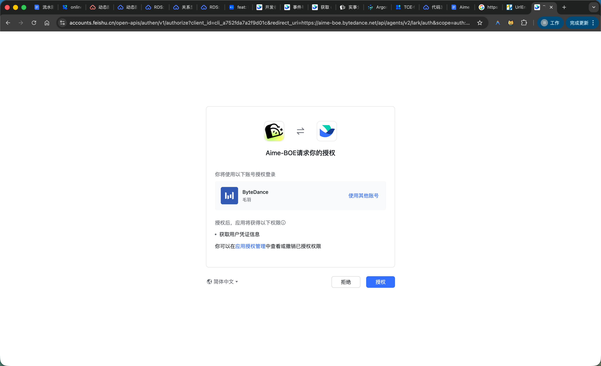
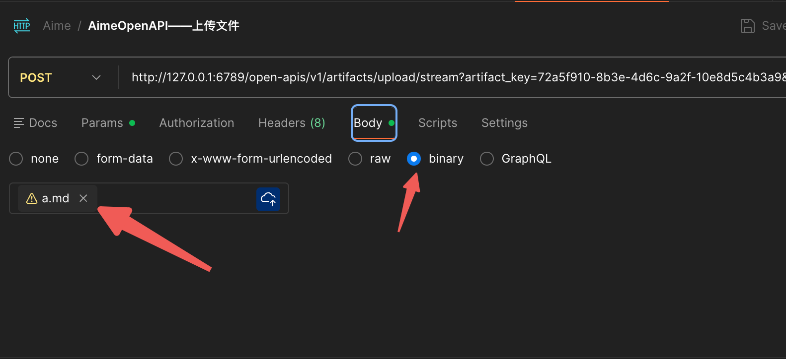
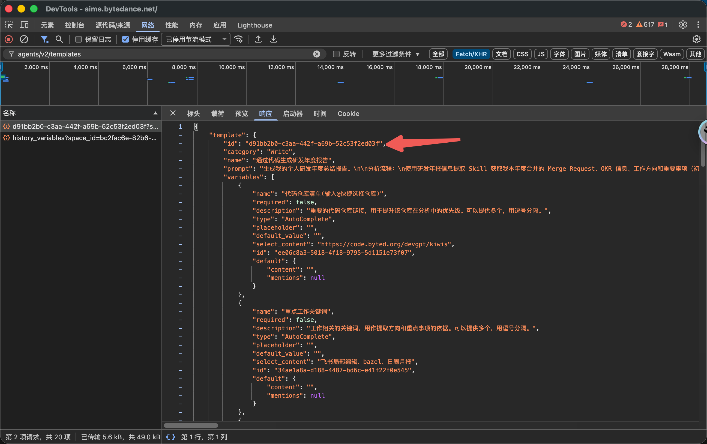
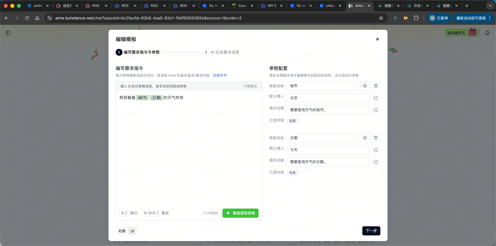
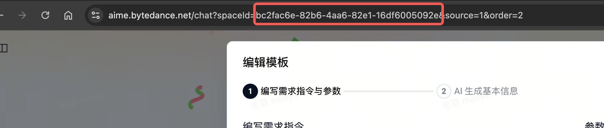

<!-- BLOCK_1 | doxcnjtyXLj4Pc9AoMrwcHhundf -->
## Aime OpenAPI 是什么？<!-- 标题序号: 1 --><!-- END_BLOCK_1 -->

<!-- BLOCK_2 | ORGCd7CtEoJQ5QxslvhcNyKynXf -->
**<font color="blue">Aime</font>** 是面向字节跳动内部使用的智能体助手，集成了公司内部的常用工具，可自动化处理调研、文档生成、代码编写、数据分析等日常任务。
<!-- END_BLOCK_2 -->

<!-- BLOCK_3 | doxcnX6nslkD87X2p82IYi7Zb5e -->
 **<font color="blue">Aime OpenAPI</font>** 是基于 Aime 平台推出的开放接口服务，使开发者能够在任何第三方系统或工作流中无缝集成 Aime 的任务编排与执行能力。通过简单的 HTTP 请求，可以自动化执行模板调用、订阅任务状态并获取最终产物，从而实现高度自动化的执行流程。
<!-- END_BLOCK_3 -->

<!-- BLOCK_4 | doxcnlWhfzMn0QFSOZISZctABih -->
<callout icon="star" bgc="4" bc="4">
**核心优势**
- **灵活的任务定制**：支持通过 webhook 和丰富的参数配置，灵活定制任务流程与回调逻辑，允许用户订阅首轮的状态回调。同时允许用户自定义任务处理完成的消息卡片样式。
<!-- comment for text `灵活的任务定制`：支持多轮会话吗 这个暂时不支持@zhujingyan.43@bytedance.com  想请教一下，不支持多轮会话的话，触发任务后，如果aime执行中遇到了要用户交互的步骤会怎么样，会直接失败吗？比如我让它看一个页面，它让我扫码登录这种 这种暂时不支持，aime会直接给用户发通知，让用户来aime里操作 -->- **统一的认证与安全**：需要多种认证方式同时认证（JWT, ZTI Token），保障服务调用的安全与合规。
- **清晰的产物交付**：标准化任务产物结构，无论是文档、代码还是其他资源，都能以可预测的格式进行下载与消费。
</callout>
<!-- END_BLOCK_4 -->


<!-- BLOCK_5 | VfLXdd9QromYlAxXErrccJclnlu -->
## 申请流程（暂停中 ⏸️）<!-- 标题序号: 2 --><!-- comment for text `申请流程（暂停中 ⏸️）`：请问后续还会有新的API暴露吗，比如工作流执行、批量执行、进度查询等 --><!-- comment for text `暂停中`：恢复以后QPS能提高一些吗？ --><!-- comment for text `申请流程`：提交完能看到审批进度吗 --><!-- comment for text `申请流程`：在没有具体psm的情况下有支持调试的办法吗，想前置调研和尝试下这块能力 这个暂不支持@zhujingyan.43@bytedance.com  想在本地 cli 中调用，那有相关 aime cli 能力发起任务吗？ --><!-- END_BLOCK_5 -->

<!-- BLOCK_6 | MOczd9LLDoc60ixpOSAcqDUVnzb -->
<callout icon="pushpin" bgc="2" bc="2">
**通知：目前 Aime 正在架构升级中，暂时不支持 openapi 接入申请，升级后会恢复申请通道，请大家留意内测群通知，如有问题可联系**@(heyilin.eve@bytedance.com)**&nbsp;咨询。**
<!-- comment for text `升级后会恢复申请通道`：有预期的恢复时间吗@huangqingqing.324@bytedance.com  预计最快最快Q2初~ --></callout>
<!-- END_BLOCK_6 -->


<!-- BLOCK_7 | EVJZdnddho0hirx2RTucHnMjn5d -->

<!-- comment for text `[画板]`：提交申请后，如何知道注册成功 当前申请量较大，我这边会逐批审批，有结果会主动联系同学 请问有个大概的申请结果的时间不 同问。提交申请后，如何知道注册成功 --><!-- END_BLOCK_7 -->

<!-- BLOCK_8 | EIqOdqpo4ohcAhxHaz0cfSF1neg -->
**申请信息概览：**
<!-- comment for text `申请信息概览：`：申请后多长时间后通过呢 --><!-- END_BLOCK_8 -->

<!-- BLOCK_9 | R4aWdOl1aoVSeGxevCfcHovnnSc -->
> 提交方式：[bytedance.larkoffice.com](https://bytedance.larkoffice.com/share/base/form/shrcnb8QEtyCZ9l5v74YlFjON3g)
> 
<!-- END_BLOCK_9 -->

<!-- BLOCK_10 | QPHjddsphoP8dhx6kLac0Xqknyd -->
- 接入方产品：<font color="gray">功能展示平台</font>
<!-- END_BLOCK_10 -->

<!-- BLOCK_11 | Zh12dLgmsoSFfZxVHfXcCClhnWc -->
- 场景介绍：
> 辛苦尽可能提供相对完整的调用方案，如有相关PRD和技术方案将加快申请效率
> 
<!-- comment for text `辛苦尽可能提供相对完整的调用方案，如有相关PRD和技术方案将加快申请效率`：请问支持个人项目接入吗 -->	1. <font color="gray">具体通过什么方式调用接口</font>
	2. <font color="gray">提供什么场景的AI能力</font>
	3. <font color="gray">预期展示功能页面截图（需要在功能发起和结果展示页面有「能力由Aime 提供」相关文案和跳转链接）</font>
<!-- END_BLOCK_11 -->

<!-- BLOCK_12 | PolNdnacmoNl5oxjhYTccOjmnKf -->
- 接口 POC：<font color="gray">后续负责补充申请信息和管理申请接口的主要对接人</font>
<!-- END_BLOCK_12 -->

<!-- BLOCK_13 | IIKWdxHRfoGCaixAFCdcq5JWnkg -->
- 二级部门：<font color="gray">POC所属部门</font>
<!-- END_BLOCK_13 -->

<!-- BLOCK_14 | WvtXdOZBCoyYR8xIUPYclgJdnPd -->
- 预期调用模版链接：<font color="gray">需要与后续实际使用的模版链接场景，链接可以后续做替换</font>
<!-- END_BLOCK_14 -->

<!-- BLOCK_15 | EOlydAr92o17EOxOLPkcEXwenZc -->
- 预估调用量：<font color="gray">WAU、WPV</font><font color="gray">、QPM</font>
<!-- comment for text `WAU、WPV`：这俩东西的定义是啥啊，有没有具体解释？ 周活跃用户量，周调用次数 --><!-- END_BLOCK_15 -->

<!-- BLOCK_16 | RLmwdeR3Ko4pExxWVdPcYqVxn0d -->
- 认证 ID：<font color="gray">用于作为注册账户名</font>
<!-- END_BLOCK_16 -->

<!-- BLOCK_17 | Dzd7dqWgxo90vNxTcT9cKAwxndg -->
- 其他信息
<!-- END_BLOCK_17 -->

<!-- BLOCK_18 | Cf8vdy2wEogXFrxhSNGcS0C0n5c -->
<callout icon="eyes" bgc="2" bc="2">
注册时需要提供
- PSM：调用方PSM，在使用时会严格校验来自于该PSM的请求
<!-- comment for text `调用方PSM，在使用时会严格校验来自于该PSM的请求`：没有固定psm呢，比如aime封装的接口会对较多psm做处理，可以吗 大概的场景是什么呢 做rca可能需要对广告链路下各个psm做指定mr link下code diff的识别 先看下aime本身提供的codebase触发器是否可以满足诉求，如果不ok，再和产品聊下使用场景吧 目前直接在aime界面手动触发的都是可以看到的，功能很强大👍 -->- 账号名称：[在IAM中注册](https://cloud.bytedance.net/iam/acls/account/list)的服务账号名，在使用时会严格校验来自于该账号的请求
- 回调配置（可选）：
	- 回调地址：用于接收Aime http回调的地址，可以为空
<!-- comment for text `回调地址：用于接收Aime http回调的地址，可以为空`：这个地址是OG还是非OG的呀 服务是在i18n-TT机房，域名我不确定是在OG管控范围内哈 -->	- secret：在任务结束回调时，header中会带上提前录入的secret，可以为空
	- 需要监听的事件：第一轮会话结束回调 or 任意一轮会话结束回调，详情见[该节的](https://bytedance.larkoffice.com/docx/DfCidFlrhock0Zxzelpc4iqinte#share-Yeukd5h4sonYiLx1pFOcv4msnLg)event_type字段
- 业务host页面（可选）：发起授权后302回的业务host页面，无需发起任务前检查授权可无需提供
例如：
账号名称:       xxxxx
调用的PSM:   toutiao.xxx.xxx
回调配置:
{
    "url": "[https://x](https://slardar.bytedance.net/api_v2/os/crash/auto_fix/aime_callback)xx/callback",
    "secret": "xxx",
    "event_types": ["session.first_round.complete", "session.first_round.failed"]
}
业务host页面：https://xxx.bytedance.net/xxx
</callout>
<!-- END_BLOCK_18 -->

<!-- BLOCK_19 | VaE3d85MGoJG65xgSvEcMeUUnJf -->
<callout icon="spiral_note_pad" bgc="2" bc="2">
**审批硬性规定**
> 因合规要求和技术实现逻辑，需要具备以下三项条件才会通过审批）
> 
1. 支持在任务发起和结果消费的入口展示「能力由aime 支持/ power by Aime」文案并有对应空间主页和详情页的跳转链接
<!-- comment for text `支持在入口发起和结果消费的入口展示能力由aime 支持并有对应空间主页和详情页的跳转链接`：这个由AIME支持入口发起和结果消费入口展示能力  怎么理解？ 前端有文案描述当前能力和产物由aime提供 -->2. 任务必须是实际任务消费者发起，不能使用同一个用户身份代跑
3. 在发起任务时，需要将用户字节JWT和飞书邮箱前缀带上，并支持在用户没有授权时引导用户授权
</callout>
<!-- END_BLOCK_19 -->

<!-- BLOCK_20 | VhL0d7WFUobApUxx18LcXL7enzc -->
## Quota限制<!-- 标题序号: 3 --><!-- END_BLOCK_20 -->

<!-- BLOCK_21 | BaGydIhYPofqcjxsyCHcabYen3s -->
目前考虑到Aime任务量较大，因此每个账号注册时，会有一些基础限制，具体包括如下几点：
<!-- END_BLOCK_21 -->

<!-- BLOCK_22 | X7tJdQ1esoaostxeuWJcQQUHnif -->
- 使用次数：目前Open API使用的是个人的JWT Token，因此会消耗个人的使用次数，当次数耗尽后，触发的任务将会直接失败
<!-- END_BLOCK_22 -->

<!-- BLOCK_23 | FeqQdYuVQoQFtAxx7xxclUvFnOh -->
- 频率限制：考虑Aime目前资源量比较紧张，因此会约束QPM(Queries Per Minute)，包括个人触发任务的QPM和平台侧整体的QPM
<!-- END_BLOCK_23 -->

<!-- BLOCK_24 | UFh8dBYwMoSLeUxKctdc1VIOn9d -->
**<font background_color="red">当前仅</font><font background_color="red">提供测试版本&nbsp;</font><font background_color="red">平台QPM为5&nbsp;</font><font background_color="red">个人QPM为2</font>**
<!-- comment for text `提供测试版本 `：什么时候预计有正式版本呀？正式版本大概预计，最大差别是 QPM限制会提升吗？ --><!-- comment for text `平台QPM为5 `：咨询下，是指平台整体限制QPM，不是平台上每个用户的QPM是吗 每个人是2 QPM 举个例子，如果我的平台接入了aime的api能力，我的平台上同时有10个用户各调用了aime的api能力跑任务，这个时候这10个用户的aime任务都能提交吗 能，触发限制条件是 1. 第十一个用户当前一分钟内不行，下一分钟可以 2. 有任意一个用户同一分钟内触发第三个任务，不行 --><!-- END_BLOCK_24 -->

<!-- BLOCK_25 | doxcntjhEfcTXrZavr9DVHwekgd -->
## 快速开始<!-- 标题序号: 4 --><!-- END_BLOCK_25 -->

<!-- BLOCK_26 | doxcnud04mF9Q9LOeIioqsBw8Pb -->
> **环境域名**
> 
> - BOE：`https://aime-boe.bytedance.net/open-apis/v1`（仅供调试接口，无法在页面发起任务）
> 
> - **中国区 (CN)**: `https://aime.bytedance.net/open-apis/v1`
> 
> - **海外区 (Row-TT)**: `https://aime.byted.org/open-apis/v1`<font background_color="light_red">（ </font><font background_color="light_red">资源紧张</font><font background_color="light_red">）</font>
> 
<!-- comment for text `Row-TT`：row-TT包括US吗？ 不包括@zhujingyan.43@bytedance.com  所以在us是用不了aime api吗？ 如果你们数据可以支持同步到row 可以调用@zhujingyan.43@bytedance.com  谢谢。如果不能同步到row，未来会考虑开放给us用户吗？ 嗯嗯现在主要阻塞在资源问题，我们在努力协调 --><!-- comment for text `（ 资源紧张）`：资源紧张的情况在Q1能得到缓解吗？ 已经在申请中了，同学业务需求可以提前沟通@zhujingyan.43@bytedance.com  好的。我用的aime是https://aime.tiktok-row.net/ ，在申请api是用aime.byted.org这个域名吗？ --><!-- END_BLOCK_26 -->

<!-- BLOCK_27 | doxcnbExwnYfTGkIqE82GrlhNCc -->
### 🔐 认证方式<!-- 标题序号: 4.1 --><!-- END_BLOCK_27 -->

<!-- BLOCK_28 | doxcnTmkJHM1YIraP2P26ENnmag -->
Aime OpenAPI 需要多种认证方式，调用时需在 HTTP Header 中设置相应的鉴权信息。
<!-- comment for text `需要多种认证方式`：要两个一起提供，还是二选一即可？ 下面的三个header都需要提供哈，分别是service jwt、zti token和user jwt --><!-- END_BLOCK_28 -->

<!-- BLOCK_29 | doxcnCBPUr0milSrRF3NVSWiPrf -->
- 使用API时需要用户身份，需要将用户的JWT Token传入，即 `Authorization` (Byte-Cloud-JWT)。
<!-- END_BLOCK_29 -->

<!-- BLOCK_30 | doxcnZ4N55FuWvaUL3RhFR28s5g -->
- 使用API时需要验证服务身份，需要使用 `X-Aime-Service-JWT` 和 `X-ZTI-Token`。
<!-- END_BLOCK_30 -->

<!-- BLOCK_31 | doxcngLk50dNXfFH3HRZODcwfJh -->
请参考下文“请求头说明”部分了解各 Header 的详细用途。
<!-- comment for text `分了解各 Header 的详细用途。`：@zhujingyan.43@bytedance.com  在输入一些内部平台的链接让 aime 打开浏览器去提取内容， Api的方式不会触发 sso 登录吧？带上用户的JWT Token就不会出发了吧？ 如果调用 api 去执行任务，触发browser use的扫码登录咋办？@maoyu@bytedance.com  这个我们有事件对不 这块我得看下，暂时应该是没支持这种事件的。@maoyu@bytedance.com  这个目前有啥解决方案吗。让aime访问内部平台时会有sso登陆限制，这个怎么做自动授权@zhengyunyu.runhio@bytedance.com  还是有点难搞的，这块实际上是agent调用了browser use的工具，相当于用户在一台新的设备上登录了浏览器，目前不好绕过去 --><!-- END_BLOCK_31 -->

<!-- BLOCK_32 | doxcnpFVf24ntJkXDzKur2FpBCe -->
### ⚙️ 请求头说明<!-- 标题序号: 4.2 --><!-- comment for text `请求头说明`：文档可以帮忙开一个复制权限吗，想复制一些参数 --><!-- END_BLOCK_32 -->

<!-- BLOCK_33 | doxcn4lYcnC0oi29Jp52ZW8wE2b -->
<table col-widths="220,580">
    <tr>
        <td>**Header 名称**</td>
        <td>**描述与获取方式**</td>
    </tr>
    <tr>
        <td>`X-Aime-Service-JWT`</td>
        <td>字节云服务账号 Token，用于服务间认证。获取方式请参考[使用服务账号进行 JWT 鉴权](https://bytedance.larkoffice.com/wiki/wikcn4safFQPDPlDwmFYMV0DiNe)。</td>
    </tr>
    <tr>
        <td>`X-ZTI-Token`
<!-- comment for text `X-ZTI-Token`：是不是可以直接读实例的SEC_TOKEN_STRING 这个环境变量，不需要用zti 的sdk了 --></td>
        <td>服务 Token，获取方式请参考 [ZTI Token 获取SDK手册](https://bytedance.larkoffice.com/wiki/wikcnW3UjOHFKotdQxx2hCdSGTf)。</td>
    </tr>
    <tr>
        <td>`Authorization`</td>
        <td>格式为 `Byte-Cloud-JWT {token}`，其中 `{token}` 是字节云用户 JWT，用于用户身份认证。获取方式请参考 [通过字节云服务账号获取个人JWT Token](https://cloud.bytedance.net/docs/bytecloud/docs/63c4c6df7e9d2a021ec21002/663dd9532ef28e0300d2f00e?x-resource-account=public&x-bc-region-id=bytedance)。</td>
    </tr>
</table>
<!-- END_BLOCK_33 -->

<!-- BLOCK_34 | FuEDdbKtmop35lxqkulcvw8un0f -->
<callout icon="bangbang" bgc="2" bc="2">
在调用Aime时，需要确保用户在Aime登录过，且授权了Aime的机器人对文档操作的权限，否则发起任务会失败。目前授权有效期为1年左右，如需判断用户是否授权，可参考「[发起授权预检查](https://bytedance.larkoffice.com/wiki/CmWowLiEdiwOOrkdMRocvnHknSf#share-GHvOdwNTIohXy2xxO1RctdZYnSd)」一节
</callout>
<!-- END_BLOCK_34 -->

<!-- BLOCK_35 | AkdydlzvkorHPwxokVJcVbamn4b -->

<!-- END_BLOCK_35 -->

<!-- BLOCK_36 | doxcn8pp1eRx1UTSCOZzpKAbsje -->
### 🚀 5分钟快速体验<!-- 标题序号: 4.3 --><!-- END_BLOCK_36 -->

<!-- BLOCK_37 | doxcnsZSPAH4xCE8KVEppuSwgrb -->
通过一个简单的流程，快速了解如何使用 Aime OpenAPI 触发一个任务并获取结果。
<!-- END_BLOCK_37 -->

<!-- BLOCK_38 | doxcn4ISbyennEoYxS9kuKaDsib -->
<callout icon="bulb" bgc="5" bc="5">
**快速上手三步骤**
1. **（可选）上传资源**：如果任务需要处理特定文件，先上传资源。
2. **触发任务**：发送请求以启动一个新任务。
3. **等待回调**：任务完成后，Aime 会通过预先配置的 Webhook URL 发送回调事件。
</callout>
<!-- END_BLOCK_38 -->

<!-- BLOCK_39 | doxcnze8BgVZSWIPmO9nMdXbmNe -->
**步骤1：触发任务**
<!-- END_BLOCK_39 -->

<!-- BLOCK_40 | doxcnBY2LpyqZ9NXorrhK4tNrIe -->
构造一个 POST 请求到相应的 API 端点（具体路径请参考 [BAM IDL](https://cloud.bytedance.net/bam/rd/flow.aime.openapi/api_doc/show_doc)），并在请求体中定义任务细节。
<!-- comment for text `具体路径请参考 BAM IDL`：可以帮忙创建一个overpass吗：https://cloud.bytedance.net/overpass/idl/service?psm=flow.aime.openapi&x-resource-account=public&x-bc-region-id=bytedance 刚试了下貌似有点费劲，这个psm是不存在的，所以没办法生成overpass，等我晚点问下oncall要如何处理吧 --><!-- comment for text `构造一个 POST 请求到相应的 API 端点`：返回 {     "code": 1001,     "message": "ErrNoAuth" } 有什么排查方向吗？ 走下申请流程哈@maoyu@bytedance.com  请问提交完申请文档，怎么看有没有审批通过呀@chenjiansong.cjs@bytedance.com  当前申请量较大，我们正在逐批审批，审批结果我这边专门通知同学哈 --><!-- END_BLOCK_40 -->

<!-- BLOCK_41 | doxcn4swf3eCGussC4xS7J8Mbxe -->
```bash
# 使用 curl 触发一个示例任务
# 具体的 API 路径和请求体结构请以 BAM IDL 为准

curl --location 'https://aime.bytedance.net/open-apis/v1/tasks' \
--header 'X-Aime-Service-JWT: eyJhbGciOxxxxxN-uTRg6q7X2Y' \
--header 'Authorization: Byte-Cloud-JWT eyJhbGciOiJSUzI1NixxxxxcpA' \
--header 'X-ZTI-Token: eyJhbGciOiJSUzI1NixxxxxcpA' \
--header 'Content-Type: application/json' \
--data '{
    "role": 3,
    "template_id": "29450a5a-87d1-483e-905f-b6d6d32f378c",
    "form_value": {
        "variables": {
            "slardar_link" : {
                "content" : "https://t.wtturl.cn/Jiat9-iTk0I/" 
            } ,
            "ext_info" :{
                 "content" : "{\"key_frame_git_repo\":\"[Repository] ugc/Aweme\",\"key_frame_commit_id\":\"ad249094ec2627ea6eb93824b9521b4c0b092d6f\"}"   
            }
        }
    },
    "task_config": {
        "webhook_url": "https://callback.bytedance.net/callback?task_id=111",
        "send_user_notification": false,
        "multi_lark_group_id":[
            "oc_c325d5755e44c3e9b3c2d2a20d4fxxxx",
            "oc_c325d5755e44c3e9b3c2d20d4fxxxxxx"
        ]
    },
    "options": {
        "locale": "zh"
    },
    "space_id": "space_id",
    "external_param":"{\"pipeline_run_url\": \"https:\/\/bits.bytedance.net\/devops\/325918412802\/pipeline\/detail\/1094956946690?activeTab=RUN_SEQ__5&configs=%7B%22RUN_SEQ__5%22%3A%7B%7D%7D\"}"
}'
```
<!-- comment for text `"space_id": "space_id",`：请问这个是必传吗 --><!-- END_BLOCK_41 -->

<!-- BLOCK_42 | doxcnbH76exk8Sokvuy6bsvGx3e -->
**步骤2：获取任务 ID (Session ID)**
<!-- END_BLOCK_42 -->

<!-- BLOCK_43 | doxcnrh3ez4l9qWK3mEhYLIZFPb -->
成功触发任务后，API 会返回一个包含 `Session ID` 的响应。这个 ID 是任务的唯一标识，可以用于后续追踪。
<!-- END_BLOCK_43 -->

<!-- BLOCK_44 | doxcnJXlCugGz5QwPz4V0eH641f -->
```json
{
    "session": {
        "id": "<font background_color="light_red">4a2e76ee-e2f0-44f5-94f2-96db960aec02</font>",
        "status": "created",
        "title": "",
        "context": {
            "use_internal_tool": true,
            "agents": []
        },
        "created_at": "2025-12-22T21:35:58+08:00",
        "updated_at": "2025-12-22T21:39:55+08:00",
        "role": 3,
        "creator": "maoyu",
        "metadata": {
            "log_id": "021766410795187fdbddc0200ff2f01ffffffff0000058e88173e",
            "agent_config_version_id": "12cc15c8-9213-4fff-b3ec-11089074dc5d",
            "agent_config_id": "aca89c0f-e346-4909-9d7c-2a2c7292bf11",
            "max_resume_days": 20,
            "sleeping_time_hours": 6
        },
        "last_message_at": "0001-01-01T00:00:00Z",
        "can_resume": true,
        "can_not_resume_reason": null,
        "template_id": "",
        "source_space_id": "bc2fac6e-82b6-4aa6-82e1-16df6005092e",
        "scope": 1,
        "starred": false,
        "first_user_query": "",
        "source": "personal"
    }
}
```
<!-- comment for text `4a2e76ee-e2f0-44f5-94f2-96db960aec02`：在模板的sp里有方式获取这个id吗 这个是创建任务后的任务id@maoyu@bytedance.com  嗯，我想在分析完成后落表，就是要拿这个任务链接。模板SP里能直接获取吗 可能可以？其实就是你这次任务的链接末尾拼的uuid --><!-- END_BLOCK_44 -->

<!-- BLOCK_45 | doxcnpUfvPJEM8WJ3vkO4HLvCbb -->
**步骤3：接收 Webhook 回调**
<!-- END_BLOCK_45 -->

<!-- BLOCK_46 | doxcnN0nM3CGOfblEXXAJChHHAf -->
当任务完成（成功或失败）时，Aime 会向您在**账号注册时**或**触发任务时&nbsp;task_config** 中指定的 `webhook_url` 发送一个 `POST` 请求，通知您任务的最终状态和产物信息。详情请见“回调事件”一节。
<!-- END_BLOCK_46 -->

<!-- BLOCK_47 | doxcnyPaTZzoigJuWFS1bmNKKIc -->
---
<!-- END_BLOCK_47 -->

<!-- BLOCK_48 | doxcnVojLoyT4c6BMcUt3HaStyb -->
## 核心 API<!-- 标题序号: 5 --><!-- comment for text `核心 API`：平台能提供一个mcp吗～ 想集成到trae 使用，写文档、生成代码之类的场景 --><!-- END_BLOCK_48 -->

<!-- BLOCK_49 | doxcnA7HiFscp1zTQsxXwo9Ozrd -->
所有具体的 API 端点、请求参数和响应格式的定义，详情可参考 [BAM IDL](https://cloud.bytedance.net/bam/rd/flow.aime.openapi/api_doc/show_doc)。
<!-- END_BLOCK_49 -->

<!-- BLOCK_50 | doxcn1hS44snXFHOSMTsiyte4kf -->
### 📤 上传资源 (UploadArtifactStream)<!-- 标题序号: 5.1 --><!-- END_BLOCK_50 -->

<!-- BLOCK_51 | doxcn97NPowQZyAf3gmkvXQHKPf -->
在触发需要处理文件（如文档、代码包等）的任务之前，您需要先通过上传接口将资源上传到 Aime 平台。该接口会返回 `artifact`的结构体，可以用于在调用下述「触发任务」接口时关联此资源。
<!-- END_BLOCK_51 -->

<!-- BLOCK_52 | DhMSduZHxoNDDhxsOJzcffiwnYg -->
**接口信息**
<!-- END_BLOCK_52 -->

<!-- BLOCK_53 | VSt1dgx6eoz8VJxwLrHc4Rd7noh -->
- **请求方法** ：`POST`
<!-- END_BLOCK_53 -->

<!-- BLOCK_54 | CWMkdXbDeoMtLvxCMo6cf9HXn8g -->
- **接口路径** ：`/open-apis/v1/artifacts/upload/stream`
<!-- END_BLOCK_54 -->

<!-- BLOCK_55 | PLFzdNAR6outiEx4SrZcFNEknzT -->
- **功能**: 在触发Aime任务前，上传任务执行所需的附件
<!-- END_BLOCK_55 -->


<!-- BLOCK_56 | H7URdi3WLoOZaFx57jqckcu2n7g -->
注：上传的文件以如下形式上传
<!-- END_BLOCK_56 -->

<!-- BLOCK_57 | YAOWdY27Mo9MklxM7zicoQLqnxe -->

<!-- END_BLOCK_57 -->

<!-- BLOCK_58 | A9yJdRC7to2hf5xgIq8cLkqHnph -->
**请求参数**
<!-- END_BLOCK_58 -->

<!-- BLOCK_59 | RXu9d7H6poxjbYxebrHcFJ7kn4f -->
<table col-widths="232,147,137,304">
    <tr>
        <td>参数名称</td>
        <td>类型</td>
        <td>必需</td>
        <td>描述</td>
    </tr>
    <tr>
        <td>`artifact_key`</td>
        <td>string</td>
        <td>✅</td>
        <td>36 位 uuid，例如「72a5f910-8b3e-4d6c-9a2f-10e8d5c4b3a9」
可使用"github.com/google/uuid"的NewString()方法生成</td>
    </tr>
    <tr>
        <td>`type`</td>
        <td>string</td>
        <td>✅</td>
        <td>一般使用"file"即可
其余如有需要，从"code"、"link"、"image"、"logs"、"result"、"project" 中选择一个
<!-- comment for text `project`：project 的入参是什么 一般是一个gitlab上的仓库项目，不过目前传不了，我晚点去掉这个类型吧@maoyu@bytedance.com  后面可以支持吗 是不是输入 仓库路径就好了 or psm@guozhen@bytedance.com  这种可以在使用模板的时候作为参数传入就行了，open api本质和用户在页面上通过模板触发任务是一样的，所以你可以先人工在页面通过模板触发几个任务试下效果 --></td>
    </tr>
    <tr>
        <td>`path`</td>
        <td>string</td>
        <td>✅</td>
        <td>文件名，例如「a.jpeg」</td>
    </tr>
    <tr>
        <td>`size`</td>
        <td>int</td>
        <td>✅</td>
        <td>文件大小，单位为byte</td>
    </tr>
</table>
<!-- END_BLOCK_59 -->


<!-- BLOCK_60 | doxcnotUXkcJaBdRaPhITRnNpQb -->
### ✨ 触发任务 (CreateTask)<!-- 标题序号: 5.2 --><!-- comment for text `✨ 触发任务 (CreateTask)`：可以加一个响应示例 --><!-- comment for text `触发任务 (CreateTask)`：请求成功后会有唯一的一个任务ID吗？ --><!-- END_BLOCK_60 -->

<!-- BLOCK_61 | doxcnBRKZTqCPxmZqexzD7QZl4e -->
这是最核心的接口，用于启动一个 Aime 任务。您可以在请求中指定任务的具体要求（如 模板参数）、所需资源、以及用于接收结果的 `webhook_url`。
<!-- END_BLOCK_61 -->

<!-- BLOCK_62 | doxcnn0nW5v0Ptx4efSL2zE13Ge -->
<callout icon="thought_balloon" bgc="2" bc="2">
**Webhook 优先级**：如果在触发任务时通过 `task_config` 字段指定了 `webhook_url`，该 URL 将覆盖账号注册时配置的默认 URL，用于本次任务的回调。
</callout>
<!-- END_BLOCK_62 -->

<!-- BLOCK_63 | DBjgdBg4ro0wBsxoGBKcKZomnwb -->
**接口信息**
<!-- END_BLOCK_63 -->

<!-- BLOCK_64 | EBEZdP3sYouqRexCdX8c5hulnog -->
- **请求方法** ：`POST`
<!-- END_BLOCK_64 -->

<!-- BLOCK_65 | ZQZadjy5Oob3nBx1HYccypLOnFh -->
- **接口路径** ：`/open-apis/v1/tasks`
<!-- comment for text `/open-apis/v1/tasks`：触发任务的成功返回结果有示例么？会返回任务链接么？ 我过几天补一下，会有任务的session id，可以拼成任务链接 --><!-- END_BLOCK_65 -->

<!-- BLOCK_66 | FAjJdg58poKmgnxSyTpcWFzXnug -->
- **功能**: 通过模板触发Aime任务
<!-- END_BLOCK_66 -->

<!-- BLOCK_67 | BeUudBDMqoDPLRxVp9WcQqQrnNg -->
**请求参数**
<!-- END_BLOCK_67 -->

<!-- BLOCK_68 | Lk6EdbMCmoXK93xGep7cp7rpnbe -->
<table col-widths="232,147,137,600">
    <tr>
        <td>参数名称</td>
        <td>类型</td>
        <td>必需</td>
        <td>描述</td>
    </tr>
    <tr>
        <td>`role`</td>
        <td>int</td>
        <td>✅</td>
        <td>~~2：小美（处理任务速度较快）~~
~~3：大卫（处理任务速度较慢）~~
该字段废弃，为兼容考虑保留，填写3即可</td>
    </tr>
    <tr>
        <td>`template_id`</td>
        <td>string</td>
        <td>✅</td>
        <td>模板ID，通过在首页点击模板时，接口搜索
「agents/v2/templates」进行查看
</td>
    </tr>
    <tr>
        <td>`form_value`</td>
        <td>object</td>
        <td>❌</td>
        <td>模板中所需变量，其中
- variables下的key为参数名称（例如下图中的「城市」）
- variables key下的value中的content为参数的内容（例如下图中的「北京」）

- 如果要上传文件，则在value中的attachments中将之前上传的资源放到object中
```json
{
    "form_value": {
        "variables": {
            "城市": {
                "content": "北京",
                "attachments": [
                    {
                        "id": "71243488-6e00-42ae-a03e-928d7cb1ed2d",
                        "file_name": "file.name"
                    }
                ]
            }
        }
    }
}
```</td>
    </tr>
    <tr>
        <td>`task_config`</td>
        <td>object</td>
        <td>❌</td>
        <td>任务设置，包括
- webhook_url：任务结束后需要回调的地址
<!-- comment for text `webhook_url：任务结束后需要回调的地址`：怎么配置ppe环境？ -->- send_user_notification：是否给个人发送消息通知。选择是，会给个人发送消息卡片；选择否且在回调中配置了回调卡片，则会取multi_lark_group_id的值向群内发送通知。如果选择否且multi_lark_group_id为空，则依然会给个人发送消息通知
- multi_lark_group_id：需要发送消息卡片的群列表，同时需要配置回调卡片，[详见该节](https://bytedance.larkoffice.com/wiki/CmWowLiEdiwOOrkdMRocvnHknSf#share-IbL6drI08oGRqPxqpvtcRdZDnYc)
```json
"taks_config": {
        "webhook_url": "https://callback.bytedance.net/callback?task_id=111",
        "send_user_notification": false,
        "multi_lark_group_id":[
            "oc_c325d5755e44c3e9b3c2d2a20d4fxxxx",
            "oc_c325d5755e44c3e9b3c2d20d4fxxxxxx"
        ]
    }
```</td>
    </tr>
    <tr>
        <td>options</td>
        <td>object</td>
        <td>❌</td>
        <td>指定使用的语言，“zh”或“en”，默认“zh”</td>
    </tr>
    <tr>
        <td>space_id</td>
        <td>string</td>
        <td>❌</td>
        <td>指定空间，不指定则用个人空间，空间id可通过url获取
</td>
    </tr>
    <tr>
        <td>external_param</td>
        <td>string</td>
        <td>❌</td>
        <td>扩展参数，将一些内容存入Aime，后续Aime分析使用
```bash
"{\"pipeline_run_url\": \"https:\/\/bits.bytedance.net\/devops\/325918412802\/pipeline\/detail\/1094956946690?activeTab=RUN_SEQ__5&configs=%7B%22RUN_SEQ__5%22%3A%7B%7D%7D\"}"
```</td>
    </tr>
</table>
<!-- END_BLOCK_68 -->

<!-- BLOCK_69 | CvWwdJiaAocr0Qx7GYmcFSNMnhc -->
**错误码说明**
<!-- END_BLOCK_69 -->

<!-- BLOCK_70 | DArpdnG9UoNVfDx8Dljchf8onmg -->
<table col-widths="120,180,250,350">
    <tr>
        <td>**错误码**</td>
        <td>**错误信息**</td>
        <td>**解释**</td>
        <td>**排查建议**</td>
    </tr>
    <tr>
        <td>11201</td>
        <td>ErrCodeOpenAPIEmptyServiceJWT</td>
        <td>服务账号 JWT 为空</td>
        <td>检查请求头中是否包含 `X-Aime-Service-JWT` 字段，确保其值不为空</td>
    </tr>
    <tr>
        <td>11202</td>
        <td>ErrCodeOpenAPIEmptyUserJWT</td>
        <td>用户 JWT 为空</td>
        <td>检查请求头中是否包含 `Authorization` 字段，确保其值不为空且格式正确（`Byte-Cloud-JWT {token}`）</td>
    </tr>
    <tr>
        <td>11203</td>
        <td>ErrCodeOpenAPIInvalidServiceJWT</td>
        <td>服务账号 JWT 无效</td>
        <td>检查服务账号 JWT 是否过期或格式错误，重新生成有效的 JWT</td>
    </tr>
    <tr>
        <td>11204</td>
        <td>ErrCodeOpenAPIInvalidUserJWT</td>
        <td>用户 JWT 无效</td>
        <td>检查用户 JWT 是否过期或格式错误，重新生成有效的 JWT</td>
    </tr>
    <tr>
        <td>11205</td>
        <td>ErrCodeOpenAPIServiceJWTTypeNotMatch</td>
        <td>服务账号 JWT 类型不匹配</td>
        <td>确保使用的是服务账号类型的 JWT，而不是用户类型的 JWT</td>
    </tr>
    <tr>
        <td>11206</td>
        <td>ErrCodeOpenAPIServiceAccountNotFound</td>
        <td>服务账号不存在</td>
        <td>检查服务账号是否已在 IAM 中注册，且名称正确</td>
    </tr>
    <tr>
        <td>11207</td>
        <td>ErrCodeOpenAPIServiceAccountDisabled</td>
        <td>服务账号未启用</td>
        <td>检查服务账号状态，确保其已启用</td>
    </tr>
    <tr>
        <td>11208</td>
        <td>ErrCodeOpenAPIEmptyZTIToken</td>
        <td>ZTI Token 为空</td>
        <td>检查请求头中是否包含 `X-ZTI-Token` 字段，确保其值不为空</td>
    </tr>
    <tr>
        <td>11209</td>
        <td>ErrCodeOpenAPIInvalidZTIToken</td>
        <td>ZTI Token 无效</td>
        <td>检查 ZTI Token 是否过期或格式错误，重新生成有效的 Token</td>
    </tr>
    <tr>
        <td>11210</td>
        <td>ErrCodeOpenAPIPSMNotMatch</td>
        <td>PSM 不匹配</td>
        <td>检查请求的 PSM 是否在服务账号的允许列表中</td>
    </tr>
    <tr>
        <td>11211</td>
        <td>ErrCodeOpenAPINotAllowSudo</td>
        <td>不允许使用超级权限</td>
        <td>检查服务账号是否开启了允许 sudo 的权限，如未开启则移除 `SudoUsername` 请求头</td>
    </tr>
    <tr>
        <td>11212</td>
        <td>ErrCodeOpenAPIRateLimitExceeded</td>
        <td>超过速率限制</td>
        <td>减少请求频率，确保不超过平台和个人的 QPM 限制（当前平台 QPM 为 5，个人 QPM 为 2）</td>
    </tr>
    <tr>
        <td>11213</td>
        <td>ErrCodeOpenAPIUserNotFound</td>
        <td>用户不存在</td>
        <td>检查用户是否为字节跳动内部员工，且已在 Aime 平台注册</td>
    </tr>
    <tr>
        <td>11214</td>
        <td>ErrCodeOpenAPITemplateNotAllow</td>
        <td>模板不允许使用</td>
        <td>检查服务账号是否有权限使用指定的模板，如无权限则更换为允许的模板</td>
    </tr>
    <tr>
        <td>11215</td>
        <td>ErrCodeOpenAPISpaceNotAllow</td>
        <td>空间不允许使用</td>
        <td>检查服务账号是否有权限使用指定的空间，如无权限则更换为允许的空间</td>
    </tr>
    <tr>
        <td>11216</td>
        <td>ErrCodeOpenAPITemplateNotFound</td>
        <td>模板不存在</td>
        <td>检查模板 ID 是否正确，确保模板已在 Aime 平台创建</td>
    </tr>
    <tr>
        <td>11217</td>
        <td>ErrCodeOpenAPISpaceNotFound</td>
        <td>空间不存在</td>
        <td>检查空间 ID 是否正确，确保空间已在 Aime 平台创建</td>
    </tr>
    <tr>
        <td>11218</td>
        <td>ErrCodeOpenAPIFailToCreateSpace</td>
        <td>创建空间失败</td>
        <td>检查用户权限，确保用户有权限创建个人空间，如问题持续请联系 Aime 平台管理员</td>
    </tr>
</table>
<!-- END_BLOCK_70 -->

<!-- BLOCK_71 | PnczdOSlPolIDqxeY6RcH31fnxh -->
**返回结果示例**
<!-- END_BLOCK_71 -->

<!-- BLOCK_72 | VQ9jdnzHeoIH60xEQqGcVmssnZb -->
```json
{"event_type":"session.first_round.complete","session":{"ID":"1aca9873-23f8-4e40-baf2-b1601079dd54","Title":"Slardar 问题分析修复及报告生成，含数据收集、根因分析、代码修复与总结文档生成","Status":"idle","Creator":"pangxiangyu","Context":{"mcps":[{"id":1,"MCPID":"lark","Source":1,"name":"飞书云文档","en_name":"Lark Doc","description":"支持飞书文档下载\u0026创建功能，包括下载飞书文档/表格、生成飞书文档、飞书表格或多维表格","en_description":"Download and create Feishu docs, spreadsheets, and multi-dimensional tables.","icon_url":"https://p-devagent.bytedance.net/tos-cn-i-yx3gas52k5/mcp/icon/1828c3ddc1ee0bded5226fa76eb615a2.svg~tplv-yx3gas52k5-image.image","config":{},"creator":"linhongsen.33","created_at":"2025-05-18T14:04:17+08:00","updated_at":"2025-07-24T11:31:31+08:00","is_active":true,"type":1,"force_active":true,"session_roles":null,"source_space_id":"43619582-5be2-46a3-a9a8-660d76850c78","scope":1,"default_active":true,"permissions":null,"name_for_agent":""},{"id":123,"MCPID":"aime_enable_internal_search","Source":1,"name":"字节内场检索","en_name":"ByteDance Internal Search","description":"支持字节跳动的内场信息检索，支持飞书文档、Lark 百科词条、ByteCloude和ArcoSite作为搜索来源。","en_description":"Supports internal information retrieval within ByteDance, including sources such as Feishu Docs, Lark Wiki entries, ByteCloud, and ArcoSite.","icon_url":"http://p-devagent.bytedance.net/tos-cn-i-yx3gas52k5/25f3edca566d371de0e7b7716cde5e82.svg~tplv-yx3gas52k5-image.image","config":{},"creator":"xiazihao","created_at":"2025-05-18T14:04:20+08:00","updated_at":"2025-07-24T11:31:31+08:00","is_active":true,"type":1,"force_active":false,"session_roles":null,"source_space_id":"93ef3dba-c36a-4b19-8bf2-1bbea39ccb86","scope":1,"default_active":true,"permissions":null,"name_for_agent":""},{"id":2,"MCPID":"meego","Source":1,"name":"Meego","en_name":"Meego","description":"支持Meego平台上项目管理的多种功能，包括但不限于搜索meego空间、获取空间详情、新建\u0026修改已有需求\u0026缺陷等。","en_description":"Search Meego spaces, view details, create and update requirements or bugs.","icon_url":"http://p-devagent.bytedance.net/tos-cn-i-yx3gas52k5/7ed78774cbd8470cc37d2f2a0fba9792.svg~tplv-yx3gas52k5-image.image","config":{},"creator":"linhongsen.33","created_at":"2025-05-18T14:04:22+08:00","updated_at":"2025-07-24T11:31:31+08:00","is_active":true,"type":1,"force_active":false,"session_roles":null,"source_space_id":"43619582-5be2-46a3-a9a8-660d76850c78","scope":1,"default_active":true,"permissions":null,"name_for_agent":""},{"id":3,"MCPID":"bits_analysis","Source":1,"name":"Bits 代码分析","en_name":"Bits Analysis","description":"Bits 静态代码分析平台，可分析平台的 URL 资源，获取相关信息供后续操作使用，并根据给定条件，列出平台上特定代码仓库里的问题。","en_description":"Analyze platform URLs and list issues in specified code repositories based on custom rules.","icon_url":"https://p-devagent.bytedance.net/tos-cn-i-yx3gas52k5/mcp/icon/2078f80de48e78f0f71a6f967ecbf7be.svg~tplv-yx3gas52k5-image.image","config":{},"creator":"linhongsen.33","created_at":"2025-05-18T14:04:27+08:00","updated_at":"2025-09-04T20:02:02+08:00","is_active":true,"type":1,"force_active":false,"session_roles":null,"source_space_id":"43619582-5be2-46a3-a9a8-660d76850c78","scope":1,"default_active":true,"permissions":null,"name_for_agent":""},{"id":4,"MCPID":"codebase","Source":1,"name":"Bits 代码托管","en_name":"Bits - Code Management","description":"代码托管 MCP 提供了与代码仓库相关的各项工具，支持操作仓库代码、合并请求等功能。","en_description":"Retrieve merge request metadata and list MRs for a given repository.","icon_url":"https://p-devagent.bytedance.net/tos-cn-i-yx3gas52k5/mcp/icon/2078f80de48e78f0f71a6f967ecbf7be.svg~tplv-yx3gas52k5-image.image","config":{},"creator":"linhongsen.33","created_at":"2025-05-18T14:04:32+08:00","updated_at":"2025-09-04T20:13:02+08:00","is_active":true,"type":1,"force_active":false,"session_roles":null,"source_space_id":"43619582-5be2-46a3-a9a8-660d76850c78","scope":1,"default_active":true,"permissions":null,"name_for_agent":""},{"id":5,"MCPID":"argos","Source":1,"name":"Argos","en_name":"Argos","description":"Argos 内部应用性能监控平台，能提供日志查询服务，可以用日志 ID 搜索和获取日志。","en_description":"Search logs by ID and view performance data from internal apps.","icon_url":"https://p-devagent.bytedance.net/tos-cn-i-yx3gas52k5/mcp/icon/566299bc5a8ff4541e8f524eb273ddee.svg~tplv-yx3gas52k5-image.image","config":{},"creator":"linhongsen.33","created_at":"2025-05-18T14:04:37+08:00","updated_at":"2025-07-24T11:31:31+08:00","is_active":true,"type":1,"force_active":false,"session_roles":null,"source_space_id":"43619582-5be2-46a3-a9a8-660d76850c78","scope":1,"default_active":true,"permissions":null,"name_for_agent":""},{"id":6,"MCPID":"oncall","Source":1,"name":"Oncall","en_name":"Oncall","description":"提供访问OnCall平台数据的工具，支持通过租户ID、租户名称、时间范围搜索工单，或直接使用平台链接快速获取数据，还能获取特定OnCall群聊的详细信息。提示：直接粘贴OnCall平台链接可快速获取相同搜索结果。","en_description":"OnCall service provides tools to access OnCall platform data. Search issues by tenant ID, tenant name, time range, or directly use platform URLs for quick data retrieval. Get group chat details for specific OnCall issues. Tip: Paste OnCall platform URLs directly for quick results.","icon_url":"http://p-devagent.bytedance.net/tos-cn-i-yx3gas52k5/af02ab49828abb04995917bf15e828f6.svg~tplv-yx3gas52k5-image.image","config":{},"creator":"linhongsen.33","created_at":"2025-05-18T14:04:43+08:00","updated_at":"2025-07-24T11:31:31+08:00","is_active":true,"type":1,"force_active":false,"session_roles":null,"source_space_id":"43619582-5be2-46a3-a9a8-660d76850c78","scope":1,"default_active":true,"permissions":null,"name_for_agent":""},{"id":7,"MCPID":"arxiv","Source":1,"name":"Arxiv 论文","en_name":"Arxiv Paper","description":"Arxiv 论文仓库，可用于检索论文内容。","en_description":"Search and retrieve academic papers.","icon_url":"http://p-devagent.bytedance.net/tos-cn-i-yx3gas52k5/f427cdb90f059726ef06772df567e0d3.png~tplv-yx3gas52k5-image.image","config":{},"creator":"linhongsen.33","created_at":"2025-05-18T14:04:48+08:00","updated_at":"2025-07-24T11:31:31+08:00","is_active":true,"type":1,"force_active":false,"session_roles":null,"source_space_id":"43619582-5be2-46a3-a9a8-660d76850c78","scope":1,"default_active":true,"permissions":null,"name_for_agent":""},{"id":9,"MCPID":"google_image_search","Source":1,"name":"谷歌图片搜索","en_name":"Google Image Search","description":"谷歌图片搜索服务，能从全网提供海量高质量、免版税的图片。","en_description":"Google Images, Access high-quality, royalty-free images from across the web.","icon_url":"https://p-devagent.bytedance.net/tos-cn-i-yx3gas52k5/mcp/icon/92aa45274364427baf1f6273f71bcb24.png~tplv-yx3gas52k5-image.image","config":{},"creator":"linhongsen.33","created_at":"2025-05-18T14:04:58+08:00","updated_at":"2025-07-24T11:31:31+08:00","is_active":true,"type":1,"force_active":false,"session_roles":null,"source_space_id":"43619582-5be2-46a3-a9a8-660d76850c78","scope":1,"default_active":true,"permissions":null,"name_for_agent":""},{"id":10,"MCPID":"yfinance","Source":1,"name":"雅虎金融","en_name":"Yahoo Finance","description":"可从雅虎金融获取股票数据、新闻及其他金融信息。","en_description":"Yahoo Finance, fetch stock prices, financial news, and market data.","icon_url":"https://p-devagent.bytedance.net/tos-cn-i-yx3gas52k5/mcp/icon/414b231cefd67d9c97c2f5afed8d2501.png~tplv-yx3gas52k5-image.image","config":{},"creator":"linhongsen.33","created_at":"2025-05-18T14:05:03+08:00","updated_at":"2025-07-24T11:31:31+08:00","is_active":true,"type":1,"force_active":false,"session_roles":null,"source_space_id":"43619582-5be2-46a3-a9a8-660d76850c78","scope":1,"default_active":true,"permissions":null,"name_for_agent":""},{"id":11,"MCPID":"a_map","Source":1,"name":"高德地图","en_name":"A-map","description":"高德地图服务，覆盖中国内地、香港、澳门和台湾地区，可提供位置搜索、坐标查询、路线规划、天气查询等地图相关功能。","en_description":"A-Map services covering mainland China, Hong Kong, Macau, and Taiwan. Supports location search, coordinate lookup, route planning, and weather info.","icon_url":"http://p-devagent.bytedance.net/tos-cn-i-yx3gas52k5/419d267d5ba937984ddc78ea0bcc125d.webp~tplv-yx3gas52k5-image.image","config":{},"creator":"linhongsen.33","created_at":"2025-05-18T14:05:08+08:00","updated_at":"2025-07-24T11:31:31+08:00","is_active":true,"type":1,"force_active":false,"session_roles":null,"source_space_id":"43619582-5be2-46a3-a9a8-660d76850c78","scope":1,"default_active":true,"permissions":null,"name_for_agent":""},{"id":12,"MCPID":"google_maps","Source":1,"name":"谷歌地图","en_name":"Google Map","description":"谷歌地图服务，支持中国大陆以外地区的位置搜索、坐标查询、路线规划、天气查询等地图相关功能。","en_description":"Google Map services outside mainland China. Includes location search, coordinate lookup, route planning, and weather info.","icon_url":"https://p-devagent.bytedance.net/tos-cn-i-yx3gas52k5/mcp/icon/6e0ecadfd1246bb35859d71d565f1831.webp~tplv-yx3gas52k5-image.image","config":{},"creator":"linhongsen.33","created_at":"2025-05-18T14:05:13+08:00","updated_at":"2025-07-24T11:31:31+08:00","is_active":true,"type":1,"force_active":false,"session_roles":null,"source_space_id":"43619582-5be2-46a3-a9a8-660d76850c78","scope":1,"default_active":true,"permissions":null,"name_for_agent":""},{"id":198,"MCPID":"devmind","Source":1,"name":"Bits 数据洞察","en_name":"Bits - Devmind","description":"支持解读数据洞察指标故事或洞察报告，生成一份飞书总结文档。","en_description":"Support the interpretation of Devmind metric stories or insight reports and generate a Feishu summary document.","icon_url":"https://p-devagent.bytedance.net/tos-cn-i-yx3gas52k5/mcp/icon/2078f80de48e78f0f71a6f967ecbf7be.svg~tplv-yx3gas52k5-image.image","config":{},"creator":"lizhenan.saka","created_at":"2025-06-04T12:08:33+08:00","updated_at":"2025-09-04T20:19:34+08:00","is_active":true,"type":1,"force_active":false,"session_roles":null,"source_space_id":"c2efd3c6-944b-4f91-97ff-27e69d6fd9d5","scope":1,"default_active":true,"permissions":null,"name_for_agent":""},{"id":201,"MCPID":"hummer","Source":1,"name":"Hummer","en_name":"Hummer","description":"Hummer官方MCP，支持查询安卓应用的构建/Sync相关信息，包含大盘数据，单点数据，趋势数据，列表明细，以及构建错误数据。","en_description":"Supports querying build/Sync time information for Android apps, as well as build error data.","icon_url":"https://tosv.byted.org/obj/ttclient-android/output.png","config":{},"creator":"lizhenan.saka","created_at":"2025-06-04T16:30:55+08:00","updated_at":"2025-07-24T11:31:31+08:00","is_active":true,"type":1,"force_active":false,"session_roles":null,"source_space_id":"c2efd3c6-944b-4f91-97ff-27e69d6fd9d5","scope":1,"default_active":true,"permissions":null,"name_for_agent":""},{"id":268,"MCPID":"SlardarApp","Source":1,"name":"SlardarApp","en_name":"SlardarApp","description":"Slardar客户端官方MCP，支持通过一个Slardar issue详情页链接，获取issue趋势、基础信息、维度分布、异常堆栈、栈帧git链接等信息","en_description":"The official MCP for the Slardar client supports a link to the Slardar issue details page for issue trends, base information, dimension distribution, exception stacks, git links to stack frames, and more!","icon_url":"https://lf3-static.bytednsdoc.com/obj/eden-cn/alryht_wjt_kbvsjlafi/ljhwZthlaukjlkulzlp/slardar_icon.png","config":{"psm":"appmonitor.apm.autofix"},"creator":"lizhenan.saka","created_at":"2025-06-10T19:17:17+08:00","updated_at":"2025-09-19T17:57:15+08:00","is_active":true,"type":4,"force_active":false,"session_roles":null,"source_space_id":"c2efd3c6-944b-4f91-97ff-27e69d6fd9d5","scope":1,"default_active":true,"permissions":null,"name_for_agent":""},{"id":366,"MCPID":"SlardarWeb","Source":1,"name":"SlardarWeb","en_name":"","description":"Slardar 前端问题定位工具, 用于获取页面 js 错误、白屏等前端故障场景的问题详情, 帮助问题定位和修复。","en_description":"","icon_url":"https://lf3-static.bytednsdoc.com/obj/eden-cn/alryht_wjt_kbvsjlafi/ljhwZthlaukjlkulzlp/slardar_icon.png","config":{"base_url":"https://mcps.bytedance.net/servers/slardar_web/mcp"},"creator":"lizhenan.saka","created_at":"2025-06-19T21:04:13+08:00","updated_at":"2025-07-24T11:31:31+08:00","is_active":true,"type":3,"force_active":false,"session_roles":null,"source_space_id":"c2efd3c6-944b-4f91-97ff-27e69d6fd9d5","scope":1,"default_active":true,"permissions":null,"name_for_agent":""},{"id":461,"MCPID":"Bits-AppCenter","Source":1,"name":"Bits 应用中心","en_name":"Bits - AppCenter","description":"应用中心的 MCP，用于操作字节内部的常见组件（app）## 应用或者APP 1. 可以通过获取用户 App 列表的接口查询用户有哪些App。 2. 根据 appcenter_app_id 可以获取应用信息，应用信息包括 SOT 目录列表 3. 用户的操作都是针对上述 SOT 目录中的文件进行的，通过文件名称可以判断配置描述的资源是什么 4. 对于配置的操作，需要先通过 ListSOT 查询可用的 SOT 列表，每个应用都要传入一个目录 ## 配置修改注意事项 1. 命名合适的分支名，对不同文件的变更修改需要用同一个分支，这样才能一起提交 2. 注意传递参数时 path 中如果已经包含了文件名，则不要再重复添加文件名 3. primaryIdentifier 是系统自动生成，生成新配置时请完全不要填写任何内容，包括 @type 字段 4. 不能只做一个资源的更改，需要对所有要变更的相关资源都做修改，不许偷懒","en_description":"MCP for application management is used to operate common components (apps) within ByteDance. ","icon_url":"https://p-devagent.bytedance.net/tos-cn-i-yx3gas52k5/mcp/icon/2078f80de48e78f0f71a6f967ecbf7be.svg~tplv-yx3gas52k5-image.image","config":{"psm":"bytedance.mcp.bits_app_center"},"creator":"linhongsen.33","created_at":"2025-06-30T14:23:51+08:00","updated_at":"2025-09-04T20:04:13+08:00","is_active":true,"type":4,"force_active":false,"session_roles":null,"source_space_id":"43619582-5be2-46a3-a9a8-660d76850c78","scope":1,"default_active":true,"permissions":null,"name_for_agent":""},{"id":1039,"MCPID":"image_search","Source":1,"name":"图片搜索","en_name":"Image Search","description":"提供基于关键词的图片搜索功能，支持获取高质量图片资源，适用于图文配图、内容创作、素材采集等场景。","en_description":"Provides intelligent image search based on keywords, supporting retrieval of high-quality images. Suitable for content creation, article illustration, and visual asset collection.","icon_url":"https://p-devagent.bytedance.net/tos-cn-i-yx3gas52k5/0095205d1ff6adf02689485912b87cee.svg~tplv-yx3gas52k5-image.image","config":{},"creator":"linhongsen.33","created_at":"2025-08-11T21:28:28+08:00","updated_at":"2025-08-11T21:28:28+08:00","is_active":true,"type":1,"force_active":false,"session_roles":null,"source_space_id":"43619582-5be2-46a3-a9a8-660d76850c78","scope":1,"default_active":true,"permissions":null,"name_for_agent":""},{"id":1065,"MCPID":"067ad74a-b1d3-4cbf-9d08-5b3e93f5773f","Source":2,"name":"Build_CodeEngine","en_name":"","description":"支持代码仓库的代码查找，代码修改后的代码检测等","en_description":"","icon_url":"","config":{"psm":"bytedance.mcp.build_code_engine"},"creator":"wangtao.steven","created_at":"2025-08-12T22:24:04+08:00","updated_at":"2025-08-12T22:24:04+08:00","is_active":false,"type":4,"force_active":false,"session_roles":null,"source_space_id":"4926288f-3ed0-407e-aa13-7c96aacf163f","scope":1,"default_active":false,"permissions":null,"name_for_agent":""}]},"RuntimeMetaData":{"error":"","agent_config_id":"aca89c0f-e346-4909-9d7c-2a2c7292bf11","agent_config_name":"","agent_config_version":438,"agent_config_version_id":"f4a5adfb-d51e-4c36-8fb3-e2e721edf8fd","log_id":"202510091408568BA833126ABCDAA4FE23","ab_params":null},"Role":3,"TemplateID":"27cdd56e-723e-4ad7-a7b7-96e8f74756b2","SourceSpaceID":"1aa245de-5e0a-438e-ac7a-aad7fae0ad55","StartedAt":"2025-10-09T14:08:57.255+08:00","LastMessageAt":"2025-10-09T14:08:57+08:00","CreatedAt":"2025-10-09T14:07:49+08:00","UpdatedAt":"2025-10-09T14:18:03+08:00","CanResume":true,"CanNotResumeReason":0,"LatestAgentResumeAt":"2025-10-09T14:08:57+08:00","Scope":0,"DeletedAt":null,"Source":3,"SourceID":"slardar","PermissionActions":null,"Starred":false,"WorkItemInfo":null},"data":{"content":"","code":0,"attachment":[{"id":"6bb4158c-621b-4424-bfc1-945d30c082aa","length":21693983,"type":"project","path":"Npth","sub_type":"repo","url":"","version":2},{"id":"b80e8f9a-089c-43e3-b641-69ad4f499c3e","length":1296377,"type":"project","path":"Godzilla","sub_type":"repo","url":"","version":1},{"id":"ac722938-dfa3-4ca3-87e3-12f444ffab26","length":457616,"type":"project","path":"route-monitor","sub_type":"repo","url":"","version":1},{"id":"e24f314c-e834-448d-a956-80fac09d567f","length":242510,"type":"project","path":"PageX","sub_type":"repo","url":"","version":1},{"id":"29614b1c-7175-4ecd-8dd6-b883c72cb1db","length":832144260,"type":"project","path":"Toutiao","sub_type":"repo","url":"","version":1},{"id":"efb3d629-055c-450b-ba5c-1816522975d4","length":1961687,"type":"project","path":"saveu","sub_type":"repo","url":"","version":1},{"id":"faff6a2d-e2bd-42bb-a03e-cbc1e8191c2d","length":0,"type":"link","path":"飞书总结文档","sub_type":"lark_doc","url":"https://bytedance.larkoffice.com/docx/AgyOdZ78RoJ8ykxRy9FcUa5EnRb","version":1},{"id":"83027340-640a-47ce-8e00-7bc23533ba92","length":1062,"type":"file","path":"summary.md","sub_type":"md","url":"","version":0},{"id":"83027340-640a-47ce-8e00-7bc23533ba92","length":13255,"type":"file","path":"analysis_report.md","sub_type":"md","url":"","version":0},{"id":"83027340-640a-47ce-8e00-7bc23533ba92","length":2271,"type":"file","path":"patch.diff","sub_type":"Diff","url":"","version":0},{"id":"83027340-640a-47ce-8e00-7bc23533ba92","length":174,"type":"file","path":"git_branch.xml","sub_type":"XML","url":"","version":0}],"created_at":"2025-10-09T14:07:49+08:00"},"share_id":"29487b09-deb1-4321-9eef-adfa38306e62"}
```
<!-- END_BLOCK_72 -->

<!-- BLOCK_73 | doxcnQvpxxlxfzncGFD2x70A3bb -->
### 📥 下载产物 (<font color="gray">DownlaodArtifactFileStream</font>)<!-- 标题序号: 5.3 --><!-- comment for text `📥 下载产物 (DownlaodArtifactFileStream)`：不能下载link之类的文件内容对吧？ 不能哈，可以下载md一类的文件 --><!-- END_BLOCK_73 -->

<!-- BLOCK_74 | doxcn19Y6uiSSxIXfGAw5tmGBUg -->
任务成功完成后，如果您在触发任务时设定了回调事件，则回调事件的 `data.attachment` 字段会包含产物信息。您可以通过产物信息下载任务生成的最终文件或获取链接。
<!-- END_BLOCK_74 -->

<!-- BLOCK_75 | FlhedgtnXoTb9YxlakacH3lPnvc -->
**接口信息**
<!-- END_BLOCK_75 -->

<!-- BLOCK_76 | UXMydhuoao6HkOxGIQOcSw9Vnvb -->
- **请求方法** ：`GET`
<!-- END_BLOCK_76 -->

<!-- BLOCK_77 | REccdzTWJo5RoPxRpjEcwT6snIc -->
- **接口路径** ：`/open-apis/v1/artifacts/:artifact_id/raw/*path`
<!-- END_BLOCK_77 -->

<!-- BLOCK_78 | UBMVdkCL1oLzU2xHiHNcshH4nRS -->
- **功能**: 在触发Aime任务后，下载Aime生成的产物
<!-- END_BLOCK_78 -->


<!-- BLOCK_79 | TN0ZdA5Uvo7LU8xzqNYc9LZynTd -->
**请求参数**
<!-- END_BLOCK_79 -->

<!-- BLOCK_80 | EzSid6kN2otYx2xKrKucMf1NnSf -->
<table col-widths="232,147,137,304">
    <tr>
        <td>参数名称</td>
        <td>类型</td>
        <td>必需</td>
        <td>描述</td>
    </tr>
    <tr>
        <td>`artifact_id`</td>
        <td>string</td>
        <td>✅</td>
        <td>产物ID，例如「faff6a2d-e2bd-42bb-a03e-cbc1e8191c2d」</td>
    </tr>
    <tr>
        <td>`path`</td>
        <td>string</td>
        <td>✅</td>
        <td>产物名称，例如「artifacts/generate2.png」</td>
    </tr>
</table>
<!-- END_BLOCK_80 -->


<!-- BLOCK_81 | FFwudEtqconN9txM37OcvuHInEf -->
## 其他 API<!-- 标题序号: 6 --><!-- END_BLOCK_81 -->

<!-- BLOCK_82 | K0H2duhN9ov2pCxrshKcFX9DnUe -->
### 🔓 取消任务 (SessionCancel)<!-- 标题序号: 6.1 --><!-- END_BLOCK_82 -->

<!-- BLOCK_83 | Aleld13afolBGXxe6bncvK3Knde -->
可以通过接口取消正在执行中的任务
<!-- END_BLOCK_83 -->

<!-- BLOCK_84 | RQ2md1VosoyJm0xUrVVcawTBn1b -->
**接口信息**
<!-- END_BLOCK_84 -->

<!-- BLOCK_85 | MCiidXHluoRk8dxFuNrcklJjn9f -->
- **请求方法** ：`POST`
<!-- END_BLOCK_85 -->

<!-- BLOCK_86 | Jo0qd2bBiow5m5x233UcmVKnnxg -->
- **接口路径** ：`/open-apis/v1/sessions/:session_id/cancel`
<!-- END_BLOCK_86 -->

<!-- BLOCK_87 | QFCOd9x49oqHEgxFrnmcb72Jngf -->
- **功能**: 取消正在执行的任务
<!-- END_BLOCK_87 -->


<!-- BLOCK_88 | XbNCdtFvfo1rSPxpIGYcOh8fnxd -->
**请求参数**
<!-- END_BLOCK_88 -->

<!-- BLOCK_89 | F8VNd9bkno9ElOxhzCmcpsFLndc -->
<table col-widths="232,147,137,304">
    <tr>
        <td>参数名称</td>
        <td>类型</td>
        <td>必需</td>
        <td>描述</td>
    </tr>
    <tr>
        <td>`session_id`</td>
        <td>string</td>
        <td>✅</td>
        <td>在触发任务后获得的session id（会话ID）</td>
    </tr>
    <tr>
        <td>`space_id`</td>
        <td>string</td>
        <td>✅</td>
        <td>空间ID</td>
    </tr>
</table>
<!-- END_BLOCK_89 -->


<!-- BLOCK_90 | By1wdEj0RotOZ8xuRc9cKlATnKd -->
### ⌚️ 通过模板的ShareID获取模板ID (OpenApiGetTemplateByID)<!-- 标题序号: 6.2 --><!-- END_BLOCK_90 -->

<!-- BLOCK_91 | X1XWdRs5GoNOnyxfjvAcftoAnpe -->
可以通过模板的分享链接得到模板ID，一般情况下无需使用
<!-- END_BLOCK_91 -->

<!-- BLOCK_92 | CjB2dMataox4K4xzCFjccTBVnPb -->
**接口信息**
<!-- END_BLOCK_92 -->

<!-- BLOCK_93 | LnVcdiVcFoTpAWx6EJmc6wLrn7b -->
- **请求方法** ：`GET`
<!-- END_BLOCK_93 -->

<!-- BLOCK_94 | T8ZudvXVGozPoUxtmAQcTfDSnmf -->
- **接口路径** ：`/open-apis/v1/template/:external_type/:external_id`
<!-- END_BLOCK_94 -->

<!-- BLOCK_95 | GvSrdDfavoMYGRxIGcbcscknnfg -->
- **功能**: 模板分享链接获取模板ID
<!-- END_BLOCK_95 -->

<!-- BLOCK_96 | FpdodxjXpo93wnxoo4ccwRnlnRc -->
**请求参数**
<!-- END_BLOCK_96 -->

<!-- BLOCK_97 | ABqZd66hFo5JBgxUZh2cDARmnuc -->
<table col-widths="232,147,137,304">
    <tr>
        <td>参数名称</td>
        <td>类型</td>
        <td>必需</td>
        <td>描述</td>
    </tr>
    <tr>
        <td>`external_type`</td>
        <td>int</td>
        <td>✅</td>
        <td>一般固定为1</td>
    </tr>
    <tr>
        <td>`external_id`</td>
        <td>string</td>
        <td>✅</td>
        <td>模板分享ID，例如下面链接中的「bf0ad226-c5b1-467d-8a60-c2725bd5f62c」
https://aime.bytedance.net/chat?autoreg=true&share_id=bf0ad226-c5b1-467d-8a60-c2725bd5f62c</td>
    </tr>
</table>
<!-- END_BLOCK_97 -->


<!-- BLOCK_98 | LBiEdmjMJoKyT7xi7UIcLDefn8C -->
### 🧐 发起授权预检查(OpenAPIPreCheck)<!-- 标题序号: 6.3 --><!-- END_BLOCK_98 -->

<!-- BLOCK_99 | SO0ddWraloXeZkxt6gocXPvUn9c -->
检查用户是否有搜索、创建飞书文档的权限
<!-- END_BLOCK_99 -->

<!-- BLOCK_100 | ZrRodZim2o7KZXx0OOHcs4Munxo -->
**接口信息**
<!-- END_BLOCK_100 -->

<!-- BLOCK_101 | WaFud6LtroXmMexyff0cujIFnjh -->
- **请求方法** ：`GET`
<!-- END_BLOCK_101 -->

<!-- BLOCK_102 | XjvwdeQfAozDwexwA8Tc1HbGnHs -->
- **接口路径** ：`/open-apis/v1/tasks/precheck`
<!-- END_BLOCK_102 -->

<!-- BLOCK_103 | IrPydtaQio3GfFxDHY7cgBiTn0f -->
**请求参数**
<!-- END_BLOCK_103 -->

<!-- BLOCK_104 | BsJvds9CBo9AhoxTToJctRXTnch -->
<table col-widths="232,147,137,304">
    <tr>
        <td>参数名称</td>
        <td>类型</td>
        <td>必需</td>
        <td>描述</td>
    </tr>
    <tr>
        <td>`origin_url`</td>
        <td>string</td>
        <td>✅</td>
        <td>业务方的原始页面 URL。授权流程全部完成后，用户最终将被重定向回此地址。</td>
    </tr>
    <tr>
        <td>`space_id`</td>
        <td>string</td>
        <td>❌</td>
        <td>目标工作空间的 ID。如果操作涉及特定空间，则必须提供。若不提供，将不进行空间权限检查。</td>
    </tr>
    <tr>
        <td>`auto_create_space_approval_workflow`</td>
        <td>bool</td>
        <td>❌</td>
        <td>当用户缺少空间权限时，是否自动为他们创建一个权限申请审批流。默认为 `false`。设置为 `true` 可简化用户的申请步骤。</td>
    </tr>
</table>
<!-- END_BLOCK_104 -->

<!-- BLOCK_105 | LvlidAg0QoqYdJxqoX2cjinsn3f -->
**返回结果**
<!-- END_BLOCK_105 -->

<!-- BLOCK_106 | APbhde7ocoaOSbxvdiGcfrR5nOe -->
**SpaceAuthCheck&nbsp;- 空间权限检查结果**
<!-- END_BLOCK_106 -->

<!-- BLOCK_107 | FwbYdTih5oZdRGxdN6pcsia4nRe -->
<table col-widths="150,100,450">
    <tr>
        <td>**字段**</td>
        <td>**类型**</td>
        <td>**含义**</td>
    </tr>
    <tr>
        <td>`authorization`</td>
        <td>bool</td>
        <td>用户是否拥有目标空间的权限。`true` 表示有权限，`false` 表示无权限。</td>
    </tr>
    <tr>
        <td>`apply_url`</td>
        <td>string</td>
        <td>当 `authorization` 为 `false` 且请求中 `auto_create_space_approval_workflow=true` 时，此字段会返回一个飞书审批链接，引导用户申请权限。否则为 `null`。</td>
    </tr>
</table>
<!-- END_BLOCK_107 -->

<!-- BLOCK_108 | WZIfdLX4hoTowOxxupjci3V6nle -->
**LarkAuthCheck&nbsp;- 飞书应用授权检查结果**
<!-- END_BLOCK_108 -->

<!-- BLOCK_109 | GWSrdobAKoq7dXxI2IjcyDHXnbd -->
<table col-widths="150,100,450">
    <tr>
        <td>`authorization`</td>
        <td>bool</td>
        <td>用户是否已经为 Aime 应用授予了必要的飞书权限。`true` 表示已授权，`false` 表示未授权或授权已失效。</td>
    </tr>
    <tr>
        <td>`redirect_url`</td>
        <td>string</td>
        <td>当 `authorization` 为 `false` 时，返回飞书 OAuth 2.0 授权页面的 URL。你需要将用户重定向到此地址进行授权。</td>
    </tr>
    <tr>
        <td>`authorization_denied`</td>
        <td>bool</td>
        <td>用户是否曾明确“拒绝”过授权。如果为 `true`，即使 `authorization` 为 `false`，也建议前端给予更明确的提示，告知用户需要重新授权。</td>
    </tr>
</table>
<!-- END_BLOCK_109 -->

<!-- BLOCK_110 | I5KsdNzD5oydfnx7qMIcYZ3Xned -->
交互流程
<!-- END_BLOCK_110 -->

<!-- BLOCK_111 | JDlndhtA6oGL5jxWKu0cy7nun8d -->

<!-- END_BLOCK_111 -->


<!-- BLOCK_112 | doxcnDaRuPDpBSxY4AICCNiLYKe -->
---
<!-- END_BLOCK_112 -->

<!-- BLOCK_113 | doxcn2Q0Z1FkFHmU7Mm0mNRCFef -->
## 回调事件<!-- 标题序号: 7 --><!-- END_BLOCK_113 -->

<!-- BLOCK_114 | doxcnFKnc09YCQ23eKLL4SXWCad -->
当任务执行完成后，Aime 会向指定的 `webhook_url` 发送一个 HTTP `POST` 请求。您需要确保您的服务能够正确处理此请求并返回预期的响应。
<!-- END_BLOCK_114 -->

<!-- BLOCK_115 | doxcnCPmth49o2lj3zslPo57uWc -->
### 接收请求<!-- 标题序号: 7.1 --><!-- END_BLOCK_115 -->

<!-- BLOCK_116 | doxcnwydCpHM2MiCnm24DZbu9Tf -->
**Header**
<!-- END_BLOCK_116 -->

<!-- BLOCK_117 | doxcnH9KwNLaOppoF7cCYMhInjb -->
```json
{
    "Content-Type": "application/json"
    "x-aime-token": "xxxxx"                     // 预先录入的secret
}
```
<!-- END_BLOCK_117 -->

<!-- BLOCK_118 | doxcnTzwMh8CVbvVg0rev75j7Nf -->
**Body (任务成功时)**
<!-- END_BLOCK_118 -->

<!-- BLOCK_119 | doxcnP3yjTH7ArkqYvnJTMIFzuc -->
回调 Body 中包含了事件类型、会话详情以及产物列表。
<!-- END_BLOCK_119 -->

<!-- BLOCK_120 | doxcnBLUqWQ7dZNZBh9EWxwPaJf -->
```json
{
    "event_type": "session.first_round.complete",
    "session": {
        "ID": "1aca9873-23f8-4e40-baf2-b1601079dd54",
        "Title": "Slardar 问题分析修复及报告生成...",
        "Status": "idle",
        "Creator": "pangxiangyu",
        // ... 其他 session 上下文信息
    },
    "data": {
        "content": "",
        "code": 0,
        "attachment": [
            {
                "id": "faff6a2d-e2bd-42bb-a03e-cbc1e8191c2d",
                "type": "link",
                "path": "飞书总结文档",
                "sub_type": "lark_doc",
                "url": "https://bytedance.larkoffice.com/docx/AgyOdZ78RoJ8ykxRy9FcUa5EnRb",
                "version": 1
            },
            {
                "id": "83027340-640a-47ce-8e00-7bc23533ba92",
                "length": 2271,
                "type": "file",
                "path": "patch.diff",
                "sub_type": "Diff",
                "url": ""
            }
            // ... 其他产物
        ],
        "created_at": "2025-10-09T14:07:49+08:00"
    },
    "share_id": "29487b09-deb1-4321-9eef-adfa38306e62"
}
```
<!-- END_BLOCK_120 -->

<!-- BLOCK_121 | doxcn1E08p7D0tmqEQod8RkMu5f -->
**Body (任务失败时)**
<!-- END_BLOCK_121 -->

<!-- BLOCK_122 | doxcnrsP0RjJMA18PPnWBRLtoyf -->
如果任务执行失败，Body 将包含错误信息。
<!-- END_BLOCK_122 -->

<!-- BLOCK_123 | doxcnmvLJ0duF7w2MlZnwmCIISc -->
```json
{
    "event_type": "session.first_round.failed",
    "data": {
        "content": "任务运行异常，请联系管理员",
        "code": 10002
    },
    // ... 其他相关字段
}
```
<!-- END_BLOCK_123 -->

<!-- BLOCK_124 | doxcncrBrF4vBZdreOs5diEuRle -->
### 关键回调字段解释<!-- 标题序号: 7.2 --><!-- END_BLOCK_124 -->

<!-- BLOCK_125 | doxcnHitIMv4MJX4WZjqdi4FLfh -->
<table col-widths="200,600">
    <tr>
        <td>**字段**</td>
        <td>**描述**</td>
    </tr>
    <tr>
        <td>`event_type`</td>
        <td>事件类型，用于标识任务的当前状态。目前支持：
- `session.first_round.complete`：第一轮对话成功。
- `session.first_round.failed`：第一轮对话失败。
- `session.complete`：任意一轮对话成功。
<!-- comment for text `session.complete`：一轮对话成功如何定义呢，aime需要用户澄清时（让用户不充信息或确认），算一轮对话成功吗 澄清这种暂不支持 -->- `session.failed`：任意一轮后续对话失败。</td>
    </tr>
    <tr>
        <td>`session.ID`</td>
        <td>任务的唯一标识符。</td>
    </tr>
    <tr>
        <td>`data.attachment`</td>
        <td>产物列表，一个包含多个产物对象的数组。每个对象都描述了一个产物（文件、链接等）的元信息。</td>
    </tr>
    <tr>
        <td>`attachment.type`</td>
        <td>产物的主类型。常见枚举值：
- `file`: 普通文件
- `code`: 代码文件
- `link`: 链接（如飞书文档、部署地址）
- `image`: 图片
- `project`: 项目/代码仓库
- `other`: 其他类型</td>
    </tr>
    <tr>
        <td>`attachment.sub_type`</td>
        <td>产物的子类型。例如，当 `type` 为 `file` 时，`sub_type` 通常是文件后缀（如 `pdf`, `md`）；当 `type` 为 `link` 时，`sub_type` 可能是 `lark_doc`。</td>
    </tr>
</table>
<!-- END_BLOCK_125 -->

<!-- BLOCK_126 | doxcnE8jODGVtBHrQzEHWbz9CUc -->
### 返回响应<!-- 标题序号: 7.3 --><!-- END_BLOCK_126 -->

<!-- BLOCK_127 | doxcnelL6wxWaLuX10LprUJIYle -->
为了确认回调已被成功接收，您的 Webhook 服务需要返回一个特定的 JSON 结构。
<!-- END_BLOCK_127 -->

<!-- BLOCK_128 | doxcnzW38lCo0Kjhi682u5W5jjc -->
```json
{
    "errno": 200,
    "errmsg": "success",
    "errtitle": "success"
}
```
<!-- END_BLOCK_128 -->

<!-- BLOCK_129 | doxcnsqoqSp1IoG5rHOlmidaWBh -->
Aime 服务会根据 HTTP 状态码和此响应体来判断回调是否成功。如果您的服务未返回 `2xx` 状态码或返回的 `errno` 非 `200`，Aime 将认为回调失败并记录错误。
<!-- END_BLOCK_129 -->

<!-- BLOCK_130 | doxcnHjThJKASVOjuXoAUZ3pgFg -->
<callout icon="bulb" bgc="3" bc="3">
**可选：通过回调发送飞书卡片**
如果希望 Aime 机器人在任务完成后向飞书群或个人发送消息卡片，您可以在 Webhook 响应的 `data` 字段中提供卡片信息（包括卡片id等在内的所有内容）。需要将 Aime 机器人（AppID: `cli_9a31b280a1f3d101`）提前拉入目标群聊。
<!-- comment for text `如果希望 Aime 机器人在任务完成后向飞书群或个人发送消息卡片`：怎么写pe呢？有例子参考吗 -->关于如何构造卡片变量和 `data` 结构，请参考下一节。
</callout>
<!-- END_BLOCK_130 -->

<!-- BLOCK_131 | EfWUdJeBEo7KOCxcKyych3lcnFf -->
### 卡片相关<!-- 标题序号: 7.4 --><!-- END_BLOCK_131 -->

<!-- BLOCK_132 | Zfdwdjr0Mo0gTyxm9SJcPxs2nKb -->
您在「触发任务」一节中，可设置task_config变量中的multi_lark_group_id来向多个群中发送消息。但必须绑定具体的飞书消息卡片。
<!-- END_BLOCK_132 -->

<!-- BLOCK_133 | E81Od2BMIo2sGcxtpTgc71uAnWe -->
在回调事件的返回的响应中，可参考如下内容来让Aime在multi_lark_group_id中发送消息卡片
<!-- END_BLOCK_133 -->

<!-- BLOCK_134 | OmL8ds6FhocV9dxA9eVcS404nhf -->
```json
{
    "errno": 200,
    "errmsg": "success",
    "errtitle": "success",
    "async_state": 0,
<font background_color="light_red">    "data": </font>
<font background_color="light_red">    {</font>
<font background_color="light_red">        "card_id": "AAq9De0Li5dPf",</font>
<font background_color="light_red">        "card_version": "1.0.0",</font>
<font background_color="light_red">        "card_variables": {</font>
<font background_color="light_red">            "dynamic_key_1": "这是一个普通的字符串值",</font>
<font background_color="light_red">            "dynamic_url": {</font>
<font background_color="light_red">                "url": "https://example.com/from-api"</font>
<font background_color="light_red">            },</font>
<font background_color="light_red">            "another_variable": 123</font>
<font background_color="light_red">        },</font>
<font background_color="light_red">        "add_artifacts_comment":true</font>
<font background_color="light_red">    }</font>
}
```
<!-- END_BLOCK_134 -->

<!-- BLOCK_135 | PlV9dpFCVoth3txFR0EcIJ8VnHh -->
卡片自带的默认参数：
<!-- END_BLOCK_135 -->

<!-- BLOCK_136 | YyB5dq8cpoT7Hox2B3wcnxQmnTh -->
```java
task_name：任务名称（例如，Slardar异常Issue分析与修复及相关源码下载需求）
task_name_short：任务名称前14个字符(例如，Slardar异常Issue...)
session_detail_url：任务链接（例如：https://aime.bytedance.net/chat/2ce97b4d-5813-48c0-8f1e-30ce57f098f7）
user_id：用户的uid，@用户时使用
user_email_prefix：用户邮箱前缀（例如：maoyu）
replay_detail_url：任务回放链接（如果没有回放链接生成，则降级为任务链接）
lark_doc_urls：飞书的产物信息，目前是如下固定的信息
```
<!-- END_BLOCK_136 -->

<!-- BLOCK_137 | MYTVdjW1KoEQ7wxulItcn5LhnJg -->
卡片示例：
<!-- END_BLOCK_137 -->

<!-- BLOCK_138 | AoiQdlZCToJIGyxZhsbcqaJAnqf -->
https://open.feishu.cn/cardkit/editor?cardId=AAqxWGsb7kQMB&lang=zh-CN
<!-- END_BLOCK_138 -->

<!-- BLOCK_139 | doxcnPzU9O1K6O6RxdPKHulFaOf -->
---
<!-- END_BLOCK_139 -->

<!-- BLOCK_140 | doxcn19IjaDRXHIhKvSPQLF3Ulh -->
## 使用示例<!-- 标题序号: 8 --><!-- END_BLOCK_140 -->

<!-- BLOCK_141 | C3NId7qjNoB7DDxBiqfcaCN2nle -->
### 上传资源<!-- 标题序号: 8.1 --><!-- END_BLOCK_141 -->

<!-- BLOCK_142 | PAmodvqC1o0DD3xqxrFcMJb5nLe -->
```bash
curl --location 'https://aime.bytedance.net/open-apis/v1/artifacts/upload/stream?artifact_key=72a5f910-8b3e-4d6c-9a2f-10e8d5c4b3a9&type=file&path=a%2Fa.md&size=5' \
--header 'X-Aime-Service-JWT: eyJhbGciOxxxxxN-uTRg6q7X2Y' \
--header 'Authorization: Byte-Cloud-JWT eyJhbGciOiJSUzI1NixxxxxcpA' \
--header 'X-ZTI-Token: eyJhbGciOiJSUzI1NixxxxxcpA' \
--header 'Content-Type: text/markdown' \
--data-binary '@/Users/bytedance/Downloads/a.md'
```
<!-- END_BLOCK_142 -->

<!-- BLOCK_143 | doxcnNZDvKi1BuUOEul21rE1vVd -->
### 触发任务<!-- 标题序号: 8.2 --><!-- END_BLOCK_143 -->

<!-- BLOCK_144 | doxcnlL0GCixl1u8oTUttVhxjAb -->
```bash
# 示例：通过 OpenAPI 触发一个任务
# 注意：这只是一个示例，具体的 API 路径和请求体结构请以 BAM IDL 为准

curl --location 'https://aime.bytedance.net/open-apis/v1/tasks' \
--header 'X-Aime-Service-JWT: eyJhbGciOxxxxxN-uTRg6q7X2Y' \
--header 'Authorization: Byte-Cloud-JWT eyJhbGciOiJSUzI1NixxxxxcpA' \
--header 'X-ZTI-Token: eyJhbGciOiJSUzI1NixxxxxcpA' \
--header 'Content-Type: application/json' \
--data '{
    "role": 3,
    "template_id": "29450a5a-87d1-483e-905f-b6d6d32f378c",
    "form_value": {
        "variables": {
            "slardar_link" : {
                "content" : "https://t.wtturl.cn/Jiat9-iTk0I/" 
            } ,
            "ext_info" :{
                 "content" : "{\"key_frame_git_repo\":\"[Repository] ugc/Aweme\",\"key_frame_commit_id\":\"ad249094ec2627ea6eb93824b9521b4c0b092d6f\"}"   
            }
        }
    },
    "taks_config": {
        "webhook_url": "https://callback.bytedance.net/callback?task_id=111",
        "send_user_notification": false,
        "multi_lark_group_id":[
            "om_xxxxx",
            "om_xxxxxx"
        ]
    },
    "options": {
        "locale": "zh"
    },
    "space_id": "space_id",
    "external_param":"{\"pipeline_run_url\": \"https:\/\/bits.bytedance.net\/devops\/325918412802\/pipeline\/detail\/1094956946690?activeTab=RUN_SEQ__5&configs=%7B%22RUN_SEQ__5%22%3A%7B%7D%7D\"}"
}'
```
<!-- END_BLOCK_144 -->

<!-- BLOCK_145 | OkJkdvNjCouzcNx5wOycieOqnQf -->
### 下载产物<!-- 标题序号: 8.3 --><!-- END_BLOCK_145 -->

<!-- BLOCK_146 | HxTcdtYvDo9YL9xu0NWcNykvnzb -->
```bash
curl --location 'https://aime.bytedance.net/open-apis/v1/artifacts/ca91e9f2-9c5d-4b34-bc3b-d26fcab8f9b5/raw/artifacts/generated_image_000542.png' \
--header 'X-Aime-Service-JWT: eyJhbGciOxxxxxN-uTRg6q7X2Y' \
--header 'X-ZTI-Token: eyJhbGciOiJSUzI1NixxxxxcpA' \
--header 'Authorization: Byte-Cloud-JWT eyJhbGciOiJSUzI1NixxxxxcpA'
```
<!-- END_BLOCK_146 -->

<!-- BLOCK_147 | GeOHdVgslohtYhx1u0ZcliCNn0g -->
### 取消任务<!-- 标题序号: 8.4 --><!-- END_BLOCK_147 -->

<!-- BLOCK_148 | ICh8dD3QwoWtczxjIdCc7tcJnVh -->
```bash
curl --location 'https://aime.bytedance.net/open-apis/v1/sessions/1244eb19-af0a-4710-8765-bf485ee83269/cancel' \
--header 'X-Aime-Service-JWT: eyJhbGciOxxxxxN-uTRg6q7X2Y' \
--header 'X-ZTI-Token: eyJhbGciOiJSUzI1NixxxxxcpA' \
--header 'Authorization: Byte-Cloud-JWT eyJhbGciOiJSUzI1NixxxxxcpA'
--header 'Content-Type: application/json' \
--data '{
    "space_id": "space_id"
}'
```
<!-- END_BLOCK_148 -->

<!-- BLOCK_149 | doxcnRUYFcfdlKyNAyCPcrnHcWg -->
---
<!-- END_BLOCK_149 -->

<!-- BLOCK_150 | F8BXdUIGJooKhmxiqcDcn7HZnbe -->
## 注意事项<!-- 标题序号: 9 --><!-- END_BLOCK_150 -->

<!-- BLOCK_151 | VaYpd9c1corOW4xLBdAcHvPRnhb -->
<callout icon="construction" bgc="3" bc="3">
**飞书文档的Token过期时间**
目前和飞书文档等交互的Token会有两周的强行过期时间（飞书侧限制，非Aime侧限制），因此当用户两周内没访问Aime时，则会导致无法访问到飞书文档等相关问题，因此需要让用户两周内登陆一次Aime
</callout>
<!-- END_BLOCK_151 -->

<!-- BLOCK_152 | QS7kdbml5oxQOSxiZ7GcFXk5nXc -->
针对Token过期问题，目前OpenAPI提供飞书授权的检查接口（<font color="gray">OpenAPIPreCheck</font>），考虑到流程较为复杂（需要前后端都做一些改造），因此需要做权限续期时，可由接入方的前后端共同和Aime侧沟通续期流程。
<!-- END_BLOCK_152 -->


<!-- BLOCK_153 | R7AWdBOf7oNblGxnfi9crtu1nkd -->
---
<!-- END_BLOCK_153 -->

<!-- BLOCK_154 | doxcnuctntjXkEiJSwDHS8GvcNg -->
## 反馈入口<!-- 标题序号: 10 --><!-- END_BLOCK_154 -->

<!-- BLOCK_155 | doxcn607NMqyLWdqJHiQlmImUGc -->
如果在使用过程中遇到任何问题、发现 Bug，或有任何功能建议，欢迎联系 @(maoyu@bytedance.com) 反馈。您的每一条建议对我们都至关重要！
<!-- END_BLOCK_155 -->

<!-- BLOCK_156 | doxcnIOXhuDIKgcoE3dGsTCzkTg -->
**🔗 相关链接**
<!-- END_BLOCK_156 -->

<!-- BLOCK_157 | doxcnI3jGLnaJulgyWfcH9Wlf8d -->
- **权威 API 定义**: [Aime OpenAPI BAM IDL](https://cloud.bytedance.net/bam/rd/flow.aime.openapi/api_doc/show_doc)
<!-- END_BLOCK_157 -->

<!-- BLOCK_158 | doxcnGUCZ1EVwhVMcgPJdCevlje -->
---
<!-- END_BLOCK_158 -->

<!-- BLOCK_159 | doxcnmpRCkoDE5bcUl522JPkncf -->
**最后更新时间：2025-12-18      文档版本：v2.0**
<!-- END_BLOCK_159 -->

<!-- BLOCK_160 | doxcni3O3xqpBi8VJlkbuY8bync -->
> 💡 **小贴士** ：这份文档会持续更新，建议收藏并定期查看最新版本！
> 
> ⭐   **感谢阅读！** ⭐
> 
<!-- END_BLOCK_160 -->


