<!-- 全局评论开始 -->
<!-- 注意：以下是针对整个文档的全局评论，请在理解和处理文档内容时重点参考这些评论 -->
<!-- 全局评论1：我这两天用下来有个直观的感受：Aime像是帮我在飞书工作场景里训练好的🦞，比自己养的更聪明，技能更多。 -->
<!-- 全局评论2：超级好用已经离不开 -->
<!-- 全局评论3：谁懂？就在我按照飞书指南装虾装到一半的时候，机器人都创建成功的时候，Aime 它来了 -->
<!-- 全局评论4：迭代很敏捷点赞 -->
<!-- 全局评论5：非常好用，明显提升效率，点赞！ -->
<!-- 全局评论6：Aime好像她啊呜呜呜  T - T -->
<!-- 全局评论7：请问Aime生成的文档所有者怎么才能转移给自己呢？ -->
<!-- 全局评论8：Aime 不能在某个文件夹下创建文档吗？想让他把自己的文档都创建到某文件夹下，这样好归类， 但是现在貌似实现不了，我自己用 openclaw 社区插件是能办到的。 -->
<!-- 全局评论9：@xiongtao.irene@jiyunhudong.com  可以参考这个回答哈：https://bytedance.larkoffice.com/wiki/NV9EwaPMPiNlJhkPC2CcCIoXn3g?contentTheme=DARK&last_doc_message_id=7619177838848117716&preview_comment_id=7619178007621635021&sourceType=feed&theme=light#share-CGTQdLRRZokLB8xEXORcJI8vn5e -->
<!-- 全局评论10：做的很好，我把代码仓库喂给小助手，可以不带电脑回家就能解决代码的问题了，爱死小助手了 -->
<!-- 全局评论结束 -->

<!-- BLOCK_1 | doxcnOFldKJJwb9j6eiOtidR9pg -->
## 一、Aime 个人助理是什么<!-- 标题序号: 1 --><!-- END_BLOCK_1 -->

<!-- BLOCK_2 | doxcnRhsDXZpRzZEFOciuvzx3Uf -->
**个人助理（Beta版）**是 Aime 平台向字节员工**&nbsp;AI 个人工作助理** 探索的一次形态升级。Aime 个人助理 能够更准确理解用户意图并将任务拆分为**多个并行任务批量执行**，同时调用平台与用户配置的工具与技能协同完成复杂工作。

Aime 个人助理运行在 Aime 官方提供的云端环境上，**7×24 小时在线**，并能够继承用户在 Aime 中的历史任务记录、使用偏好与工作记忆，并持续积累上下文经验，逐渐成为能够长期协助用户工作的 AI 助理。并具备 **Web&nbsp;端页面** 和**&nbsp;官方飞书机器人&nbsp;**两个发起入口。

我们的目标是打造一个 **通用、可扩展、可持续学习的 AI 工作伙伴**，陪伴字节同学更高效地处理复杂任务，让 Aime 成为你在字节跳动工作和生活的一部分。
<!-- comment for text `个人助理（Beta版）是`：highlight：纯自研，不是OpenClaw。但确实也吸收学习了优秀的设计，在此基础上做了一些微创新（eg 对话不阻塞）和工具生态打通 对话不阻塞真的舒服，OpenClaw说话等半天，简直折磨人。 --><!-- END_BLOCK_2 -->

<!-- BLOCK_3 | I5o7d1tn2oewupxW243cmsPLnCh -->
> 另外，为了保证 **合规与安全**，Aime 个人助理与用户工作电脑完全隔离，数据和权限更加可控；部分可能存在越权或打扰的能力（例如私聊消息、群卡片通知等）目前也做了限制。
> 
<!-- END_BLOCK_3 -->

<!-- BLOCK_4 | MrzedYJz3o9r2HxxrKycYJpTn7f -->

<!-- comment for text `[图片]`：底层实现也是用了 Openclaw 吗@zhouzilong.up@bytedance.com  不是，全部Aime自主研发的@wangxin.5@bytedance.com  底层支持自定义配置模型吗？@wangxin.5@bytedance.com   也就是Ame个人助理不是用的Openclaw啊，你们自主研发是参照了Openclaw 的框架吗？@pengzhenzhen.pzz@bytedance.com  因为Aime是混合模型，根据任务自主规划模型，所以不支持选择模型@wangxin.5@bytedance.com  那么都有哪几个模型呢？@liuyixuan.assassin@bytedance.com  市面上合规的模型都有@wangxin.5@bytedance.com  这个定义太模糊了，我其实也不知道合规指的是哪些，以及什么级别的合规。有具体的信息吗？🤔。或者给个模型list呢。@liuyixuan.assassin@bytedance.com  我也没有呢 --><!-- END_BLOCK_4 -->

<!-- BLOCK_5 | doxcn1kV22vP3pUVA0EYHKffKPg -->
## 二、使用方式<!-- 标题序号: 2 --><!-- comment for text `使用方式`：现在用不了么 内测名额逐步开放中，可以关注内测群的通知哈～ --><!-- END_BLOCK_5 -->

<!-- BLOCK_6 | UJtgdzo8JoJ4WexWDG2cCkobnUf -->
### **🌐 Web端**<!-- 标题序号: 2.1 --><!-- END_BLOCK_6 -->

<!-- BLOCK_7 | XFv2d2MAHoiwVgxammDcRzAHnRd -->
> 可能会有同学点击入口后显示“助理全员出勤，更多 HC 招聘中”，主要是因为目前 Aime 资源权限打满，我们不得不收紧体验权限，后续将分批发布以确保体验，没有权限的同学可以关注内测群开放权限通知。
> 
<!-- END_BLOCK_7 -->

<!-- BLOCK_8 | QFxEdzBhwonkcOxUQructwOVnjh -->
- 在 **Aime 主端页面点击个人助理入口**，或直接访问 **个人助理页面（链接）** 即可发起对话，无需本地部署。助理支持对 **昵称、回复风格及技能（Skill）等进行个性化配置。**
<!-- END_BLOCK_8 -->

<!-- BLOCK_9 | GxEBddzZeo6RZAxGqkMceaR9nxb -->
<grid cols="2">
<column width="65">
  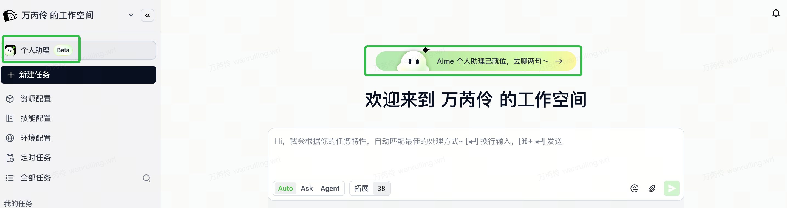
</column>
<column width="34">
  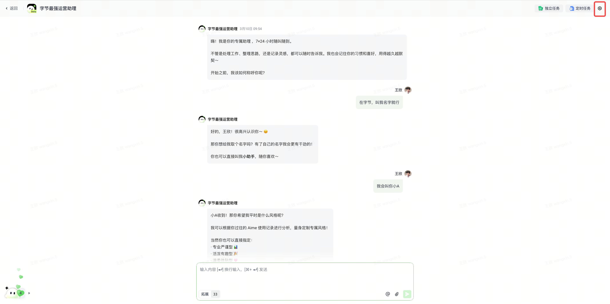
</column>
</grid>
<!-- END_BLOCK_9 -->

<!-- BLOCK_10 | ImLCdXQJQoaMJVxcukscA7Tonhe -->
### **🤖&nbsp;****飞书****机器人**<!-- 标题序号: 2.2 --><!-- END_BLOCK_10 -->

<!-- BLOCK_11 | YYffdDS50opUEtxysK2cJlGZngh -->
-  个人助理配套预置 Aime 官方飞书 bot ，免去个人 bot 注册和权限预申请流程，你可以：
	- 直接对话，像聊天一样派活
	- 任务自动同步：飞书发起的任务自动同步至Web端，实现全平台任务汇总与上下文共享
<!-- END_BLOCK_11 -->

<!-- BLOCK_12 | DLQFdFVHxoVxkZxa5S3cSkcBn9e -->
- 怎么再次找到飞书bot：
	- 搜索**「Aime 个人助理」**或 **「点击链接」**即可找到机器人；
	- Web 端对话中，唤起卡片，转到飞书对话
<!-- END_BLOCK_12 -->

<!-- BLOCK_13 | SComd2Z8AoQkSxxLzCUcH6Q6nrf -->
<grid cols="2">
<column width="52">
  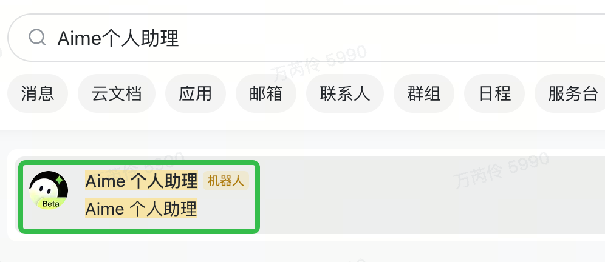
</column>
<column width="47">
  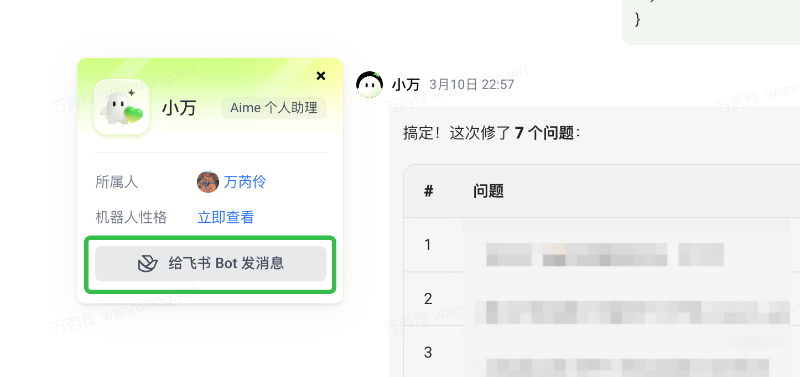
  <!-- comment for text `[图片]`：群聊怎么修改小助理的头像和名称呢？群聊里有点区别不出来是谁的ai助理 --><!-- comment for text `[图片]`：这个 bot 怎么来的 搜索「Aime 个人助理」或 「https://applink.larkoffice.com/T94ATDaNctj4 」即可找到机器人  或者在网页端和aime助理对话的过程中点击助理的头像 那个小万 ，这个bot 怎么来的@xiaoyanhui@bytedance.com  是自定义，还没上线吗@xiaoyanhui@bytedance.com  自定义bot还未上线哈，这个只是在网页端会显示个人助理的个性化命名，跳转到bot后还是统一的「Aime个人助理」 -->
</column>
</grid>
<!-- END_BLOCK_13 -->

<!-- BLOCK_14 | EuRGdHAaqo70kdx7NKpcADQtn89 -->
> 🔜 即将上线：添加自定义飞书 Bot，更灵活的个性化配置、支持他人与你的个人助理对话
> 
<!-- comment for text `：添加自定义飞书 Bot，更灵活的个性化配置、支持他人与你的个人助理对话`：这个什么时候上线呀@niehongbin@jiyunhudong.com  自定义bot的需求目前有在排期，时间预计在4月中左右，近期的优化主要优先确保大家的体验～@wanruiling.wrl@bytedance.com  现在这个个人助理已经全量发布了嘛？所有人现在都可以用啦？@niehongbin@jiyunhudong.com  目前还没有全量开放哈，现阶段每天会放出新的体验名额，可以请感兴趣的同学关注内测群～@wanruiling.wrl@bytedance.com  后续自定义的 bot 出了之后，支持把现在的配置直接迁移不～@lijiaq@bytedance.com  这个需求我们记录一下哈@liutianyi.444@bytedance.com@wanruiling.wrl@bytedance.com  什么时候放名额啊？@yangyunzhen@bytedance.com  可以关注一下内测群消息～@wanruiling.wrl@bytedance.com  是可以跟aime讲场景需求，aime自己搭建一个bot机器人么？@huangmenghui@jiyunhudong.com  这里指的是一个可自定义头像等个性化配置的Aime助理哈，具体支持哪些场景产品同学还在设计中 这个能支持接入到已经创建的机器人里吗？ 后面计划会支持 --><!-- comment for text `即将上线`：啥时候上线呀@liwencong.leven@bytedance.com  目前预计在4月中哈，可关注内测群的通知/文档的更新 求加急这个需求，真的很需要～ --><!-- END_BLOCK_14 -->

<!-- BLOCK_15 | WQvudi32fo805Kxo3lIc0Zqqn6g -->
### **👥 群聊 @ 唤起**<!-- 标题序号: 2.3 --><!-- comment for text `👥 群聊 @ 唤起`：aime现在支持设置成监听群聊消息，然后自助分析回答吗？@zhaohengfei@bytedance.com  目前你可以给他安排一个定时任务，让他每隔一段时间获取某个群的群聊消息，然后按你的要求分析，最后往群里发飞书卡片回答 --><!-- comment for text `👥 群聊 @ 唤起`：請問我可以直接在龍蝦裡面 跟他說去找誰說什麼事嗎？ 不是透過群聊@chunghao.lee@bytedance.com  aime不是龙虾哈～是aime项目组自研的个人助手，可以在web或者飞书bot里直接私聊：  - 飞书bot：搜索「Aime 个人助理」或 「https://applink.larkoffice.com/T94ATDaNctj4 」即可找到机器人 - web：https://aime.bytedance.net/assistant --><!-- comment for text `👥 群聊 @ 唤起`：好酷下次试试 --><!-- END_BLOCK_15 -->

<!-- BLOCK_16 | MsBld9wTvoApRvxoxcScrkpJnbf -->
- 在群聊中直接**&nbsp;@Aime 个人助理&nbsp;**发起任务**，平台会自动关联至你的专属个人助理。**默认使用你个人空间的配置，不共享他人的 Skill 或记忆。不同成员 @ Aime 个人助理，各自基于独立空间独立回复，互不干扰。
<!-- comment for text `个人空间`：支持切换到有权限的其他项目空间吗 目前还不支持 这个后续能支持不同人艾特这个bot都路由到一个人的空间吗，避免同步环境配置重复多次 希望后续可以支持有对应aime团队空间的助理 已经在设计了 --><!-- END_BLOCK_16 -->

<!-- BLOCK_17 | PvdqdTKLXolUhNxxFVwcFCr1ndC -->
> 注意：群里需要添加「Aime 个人助理」机器人，群成员若是 Aime 新用户则需要完成授权后正常使用Aime助理
> 
<!-- END_BLOCK_17 -->

<!-- BLOCK_18 | doxcnJegheU8mesJkapzMv3k1Oh -->
## 三、核心能力<!-- 标题序号: 3 --><!-- END_BLOCK_18 -->

<!-- BLOCK_19 | IUoJdTBC3oEoHVxJYc9c9yudnRf -->
<callout icon="raised_hands" bgc="2" bc="2">
Aime 个人助理从 Aime 成长而来，在继承原有全部能力的基础上，以全新的交互形态进行了整体升级。
继承能力有：
- **历史任务记忆与检索**：自动记录你的历史任务，随时可以调取和复用
<!-- comment for text `历史任务记忆与检索：自动记录你的历史任务，随时可以调取和复用`：还没把机器人拉进群的消息无法读取，这个和openclaw一样的问题，有办法支持吗？ -->- **历史偏好总结与分析**：分析你的使用习惯，主动推断你的偏好
- **Skill & MCP 扩展调用**：支持安装第三方及团队自定义技能，无限扩展能力边界
- **发起原有Aime任务**：助理可自主创建 Ask（直接问答）/ Auto（自主执行）/ Agent（多步复杂任务）任务，并自动进行多轮
此外，你可能更想知道 Aime 助理的升级的能力
</callout>
<!-- END_BLOCK_19 -->

<!-- BLOCK_20 | doxcnS8bwJbCTKwnIDe40qtQtKd -->
### 3.1 操作Aime助理的各种能力<!-- END_BLOCK_20 -->

<!-- BLOCK_21 | doxcntUpCTTMcFPuPntURFARCfd -->
<table header-row="true" col-widths="127,170,476,380">
    <tr>
        <td>模块</td>
        <td>功能点</td>
        <td>说明</td>
        <td>图示</td>
    </tr>
    <tr>
        <td rowspan="3">**消息管理**</td>
        <td>快速发起对话</td>
        <td>首次初始化后无需唤起
Web、个人 Bot、群聊 Bot（需@Aime个人助理）多入口发起会话</td>
        <td><grid cols="3">
<column width="59">
  
</column>
<column width="19">
  
</column>
<column width="20">
  
</column>
</grid></td>
    </tr>
    <tr>
        <td>双端信息高效同步</td>
        <td>Web 端全面展示所有对话&任务
<!-- comment for text `Web 端全面展示所有对话&任务`：这个有办法新建会话吗？个人有一些强迫症，不喜欢所有的内容都在一个上下文里面，查找的时候要翻好久 -->Bot 端快捷发起对话&任务，获取任务结果通知</td>
        <td><grid cols="2">
<column width="53">
  
</column>
<column width="46">
  
</column>
</grid></td>
    </tr>
    <tr>
        <td>无限上下文记忆</td>
        <td>独立持久化 Workspace，历史上下文与长期积累自动记忆</td>
        <td><grid cols="2">
<column width="53">
  
</column>
<column width="46">
  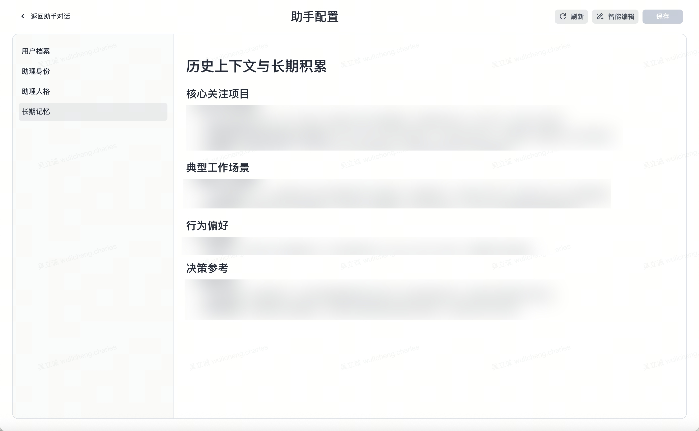
</column>
</grid></td>
    </tr>
    <tr>
        <td rowspan="3">**助理配置**</td>
        <td>助理个性化配置</td>
        <td>编辑配置文件，自定义助理的名字、性格风格与行为偏好，让助理更懂你</td>
        <td><grid cols="2">
<column width="38">
  
</column>
<column width="61">
  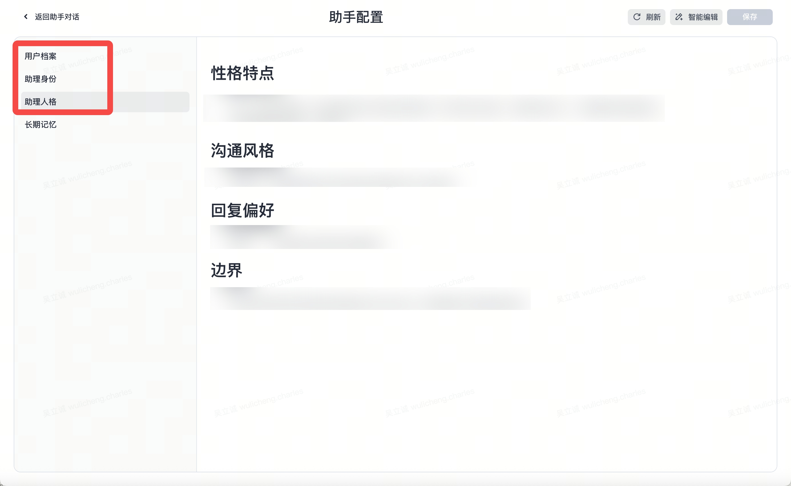
</column>
</grid></td>
    </tr>
    <tr>
        <td>MCP 同步配置</td>
        <td>与个人空间同步，无需额外配置</td>
        <td><grid cols="2">
<column width="48">
  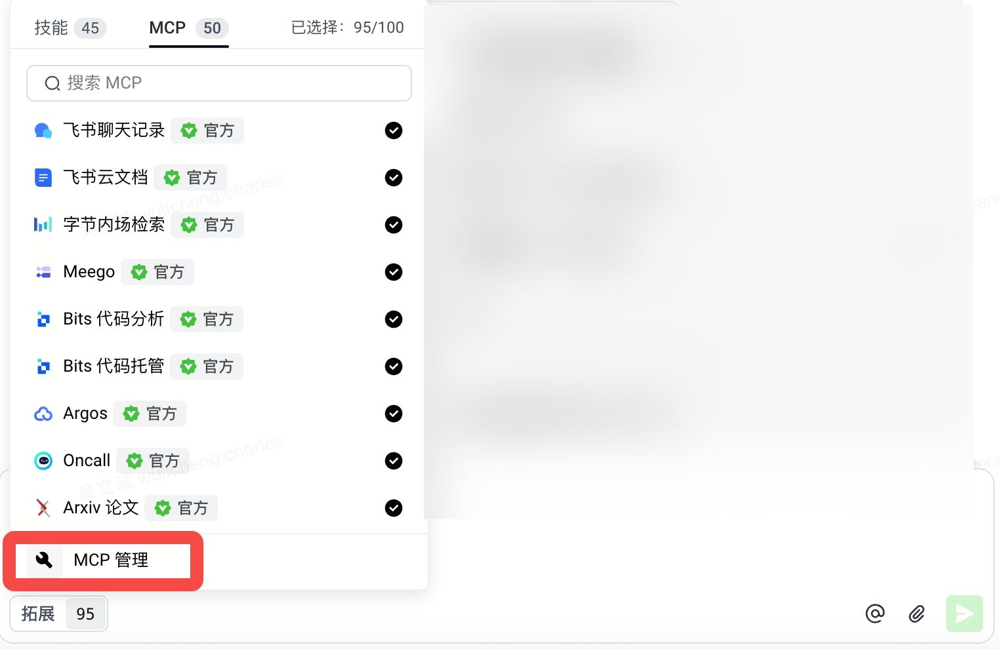
  <!-- comment for text `[图片]`：这个页面没找到，是更新了吗 这个是在对话框的拓展目录里哈 -->
</column>
<column width="51">
  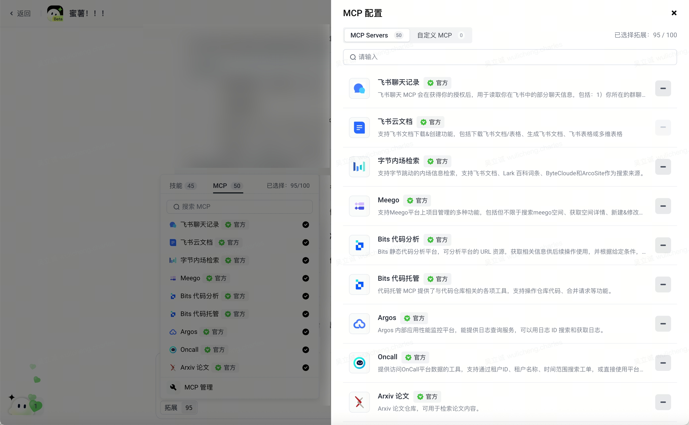
</column>
</grid></td>
    </tr>
    <tr>
        <td>Skills自举扩展</td>
        <td>搜索安装+创建更新，自主完成无需介入，定制专属能力包</td>
        <td><grid cols="3">
<column width="26">
  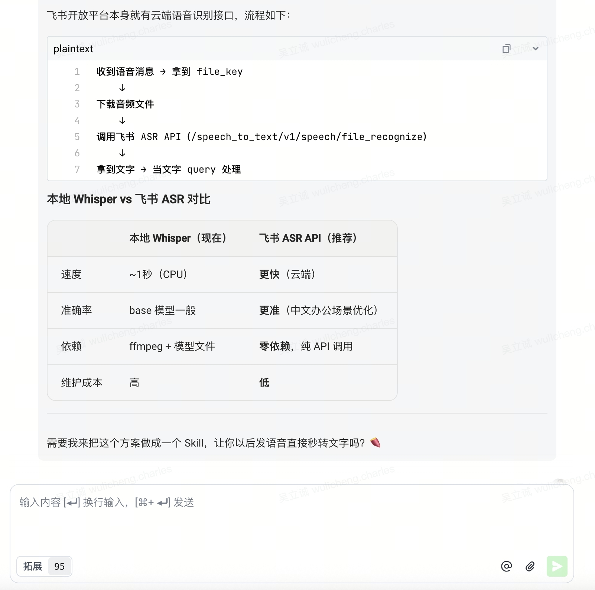
</column>
<column width="39">
  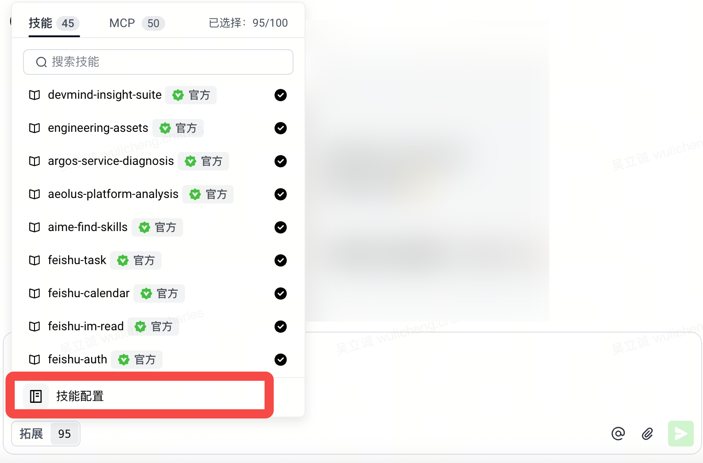
</column>
<column width="34">
  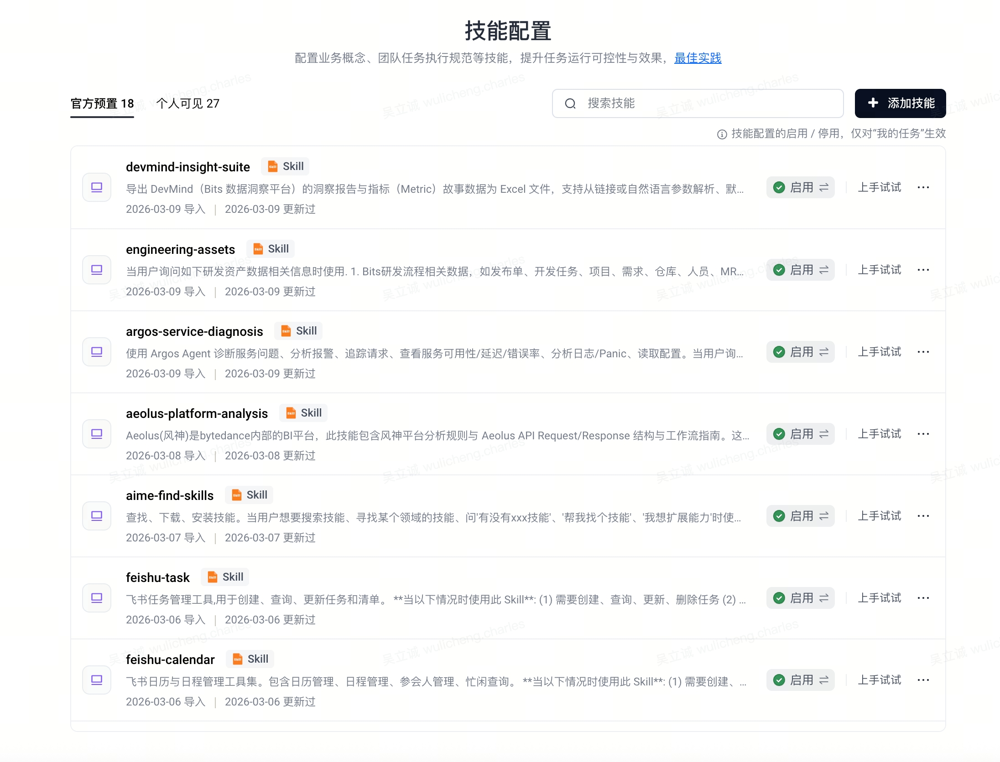
  <!-- comment for text `[图片]`：一人血书求 skill 市场～@lijiaq@bytedance.com  这个我们在同步跟进了cc @wangyiyun.0423@bytedance.com@lijiaq@bytedance.com  计划下周上线。不会做市场，会上一批aime内测过可以保障在aime平台内稳定使用的精选集@wangyiyun.0423@bytedance.com  想求一个这个~@hongyulu.915@bytedance.com  在上线的路上了，周三计划亮相 Bytedance Skills 上的应该是可以直接用的吧@wangyiyun.0423@bytedance.com  skill 精选集上线后，对应说明有吗？（便于选择），以及能提示一下 va环境支持吗@xubin.0917@bytedance.com  可以直接在 aime 上运行@yinshiting@bytedance.com  https://bytedance.larkoffice.com/docx/UaxTdbzVnoyxGYxtlLecQPhlnNb  i18n 已同步上线 -->
</column>
</grid></td>
    </tr>
    <tr>
        <td rowspan="4">**任务分发&管理**</td>
        <td>任务分配+并行执行</td>
        <td>简单问题快问快答，复杂任务智能调度
子任务与独立任务并行执行，异步通知结果</td>
        <td><grid cols="2">
<column width="51">
  
</column>
<column width="48">
  
</column>
</grid></td>
    </tr>
    <tr>
        <td>Prompt 自动优化</td>
        <td>把模糊的自然语言自动转化为高质量指令</td>
        <td><grid cols="2">
<column width="57">
  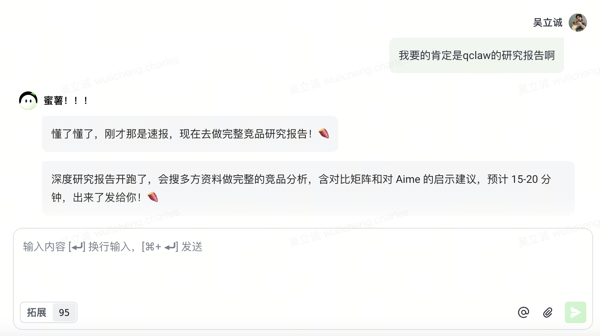
</column>
<column width="42">
  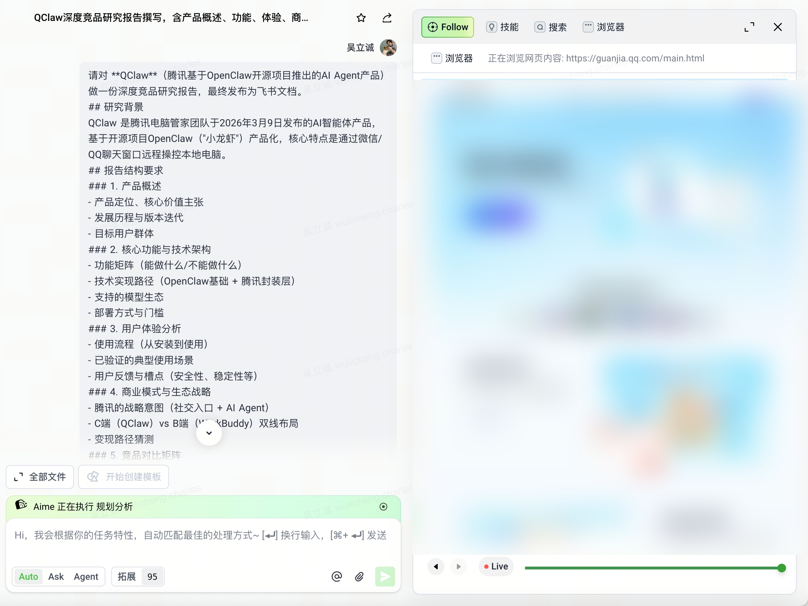
</column>
</grid></td>
    </tr>
    <tr>
        <td>设置定时任务</td>
        <td>几句话设置一个定时任务（如每日 11 点推送竞品报告）</td>
        <td><grid cols="2">
<column width="52">
  
</column>
<column width="47">
  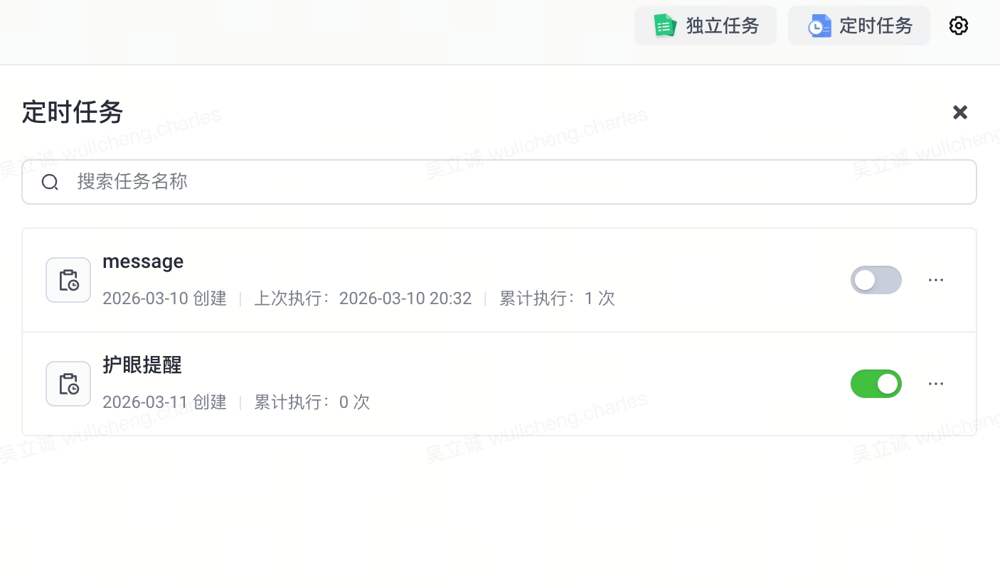
</column>
</grid></td>
    </tr>
    <tr>
        <td>独立任务管理</td>
        <td>任务列表一键打开，轻松管理</td>
        <td></td>
    </tr>
</table>
<!-- END_BLOCK_21 -->

<!-- BLOCK_22 | doxcn1rbXIcOx8d99f5UzDr2ZTf -->
### 3.2 让Aime助理执行任务的能力list<!-- comment for text ` 让Aime助理执行任务的能力list`：可以对接merlin吗？ --><!-- END_BLOCK_22 -->

<!-- BLOCK_23 | XrGUdZflsoQ532xon9Cc80kAnuc -->
<table header-row="true" col-widths="84,251,443,100">
    <tr>
        <td>场景</td>
        <td>平台/工具</td>
        <td>支持能力</td>
        <td>状态</td>
    </tr>
    <tr>
        <td rowspan="10">**飞书**
<!-- comment for text `飞书`：能否支持下飞书文档授权给他人的能力？ --><!-- comment for text `飞书`：可以支持表单提交么 请问表单提交具体是指什么意思呀？@wanruiling.wrl@bytedance.com  https://bytedance.larkoffice.com/share/base/form/shrcn1hFOh7LcAVJvrx7xvVJeHg  比如这个多维表格的提交，aime助手告诉我没权限提交 目前Aime助理创建和修改（个人有编辑权限）的文档哈，如果这个多维表格你是有编辑权限的话是可以写入的，如果没有编辑权限的话，无法支持直接写入表单哈  这类需求我们也记录一下，后续评估支持的计划～ 这个表格是公开的，任何人都可以提交@shenzhujun@bytedance.com  嗯嗯，表单本身是大家都可以提交的（不需要多维表格的编辑权限），但目前aime助理只支持填写本人有编辑权限的多维表格的表单。 同学你提供的这个场景，相当于是希望aime助理可直接填写无编辑权限的多维表格的表单，我们已同步产品记录了～ --></td>
        <td>云文档</td>
        <td>读写文档、创建 Wiki、知识库检索
<!-- comment for text `读写文档、创建 Wiki、知识库检索`：目前创建的文档没办法自动放到知识库，这个会支持么。 --><!-- comment for text `读写文档`：请问为什么aime创建的文档不能以我作为管理者或者创建在我的云盘里呀？ --><!-- comment for text `读写文档、创建 Wiki、知识库检索`：支持在特定目录下创建文档吗？目前默认都是在aime个人助理目录下 暂时不支持哈，需求我们会记录一下cc @wangyiyun.0423@bytedance.com --><!-- comment for text `读写文档`：请问这个支持在生成的文档里评论at aime 回答问题么？@caiyantao.123@bytedance.com  暂时不支持哈 --><!-- comment for text `读写文档、创建 Wiki、知识库检索`：是否支持个人空间里面的文档资源索引的读取？以及如何验证呢@jiangzezhou@bytedance.com  支持的，可以试试说：在项目空间里搜索xxx  这个搜索的说明的路径我们近期也会优化一下，和实际目录名称保持一致～ --><!-- comment for text `读写文档、创建 Wiki、知识库检索`：支持移动文档了吗，想试试让AIME在指定父文档下不断创建子文档，作为日报@shuzhanpeng@bytedance.com  请问是指在指定文档（个人有编辑权限）中创建新的文档么？这个是支持的@wanruiling.wrl@bytedance.com  为啥我的 aime 不支持，，它让我手动迁移到 wiki@wanruiling.wrl@bytedance.com  AIME助理每次都说完成了，但是子文档都没创建出来 --></td>
        <td>✅</td>
    </tr>
    <tr>
        <td>多维表格</td>
        <td>记录增删改查、字段/视图/表单管理</td>
        <td>✅</td>
    </tr>
    <tr>
        <td rowspan="2">单聊/群聊</td>
        <td>获取历史消息、话题回复读取、跨会话搜索</td>
        <td>✅</td>
    </tr>
    <tr>
        <td>团队共享助理
<!-- comment for text `团队共享助理`：这个预计什么时候会支持 --></td>
        <td>Incoming</td>
    </tr>
    <tr>
        <td>飞书日历</td>
        <td>创建/查询/修改日程、查忙闲、管理参会人、回复邀请 
<!-- comment for text `创建`：还不能约会议室吗 正在紧锣密鼓开发中～ --><!-- comment for text `创建/查询/修改日程`：拉日历时可能会误拉同名的其他人～@chenqibo.252@bytedance.com  这个是已知问题我们在跟进了cc @wangyiyun.0423@bytedance.com 好嘞～ --></td>
        <td>✅</td>
    </tr>
    <tr>
        <td>飞书任务</td>
        <td>新建/查询/完成待办、改截止时间、管理清单与成员</td>
        <td>✅</td>
    </tr>
    <tr>
        <td>飞书会议/飞书妙记</td>
        <td>接入飞书会议、获取妙记自动总结议程</td>
        <td>incoming</td>
    </tr>
    <tr>
        <td>邮件</td>
        <td>代发邮件、读取总结邮件信息</td>
        <td>incoming</td>
    </tr>
    <tr>
        <td>代发消息</td>
        <td>在单聊/群/话题/文档中代发消息/评论</td>
        <td>Incoming</td>
    </tr>
    <tr>
        <td>卡片搭建</td>
        <td>在飞书卡片搭建工具内直接创建 / 发布卡片</td>
        <td>Incoming</td>
    </tr>
    <tr>
        <td rowspan="6">**研发**
<!-- comment for text `研发`：能否支持dorado平台，以及支持查询hive数据的能力？ --></td>
        <td>Meego</td>
        <td>创建需求、需求查询、需求流转、查询需求的联动信息（开发任务、 MR）
<!-- comment for text `需求流转`：请问 这里 是如何具体控制流转的？ --></td>
        <td>✅</td>
    </tr>
    <tr>
        <td>Codebase / 代码库</td>
        <td>代码检索、函数/配置查询
<!-- comment for text `代码检索、函数/配置查询`：能写代码 ，提交mr 吗，还是只能读代码 --></td>
        <td>✅</td>
    </tr>
    <tr>
        <td>Slardar</td>
        <td>JS 错误与性能诊断、崩溃 Issue 溯源及日志堆栈分析</td>
        <td>✅</td>
    </tr>
    <tr>
        <td>Argos
<!-- comment for text `Argos`：日志查询支持ROW、EU、US TTP嘛 当前是不支持海外机房日志的查询分析的，这个后续会支持吗 --></td>
        <td>日志查询、服务可用性分析、告警分析、Trace 链路分析</td>
        <td>✅</td>
    </tr>
    <tr>
        <td>Bits / 发布单
<!-- comment for text `Bits / 发布单`：请问下什么时候可以支持 Bits MR 的 skill，目前只能走浏览器自动化来创建 MR，太低效了 --></td>
        <td>查询发布状态、发布单信息</td>
        <td>✅</td>
    </tr>
    <tr>
        <td>PSM 服务元信息</td>
        <td>查询服务负责人、部署信息</td>
        <td>✅</td>
    </tr>
    <tr>
        <td rowspan="3">**数据**
<!-- comment for text `数据`：想问下libra实验平台后续有规划接入吗 现在也是支持libra分析的，可以直接给到助理libra链接试试～ --></td>
        <td rowspan="2">风神 Aeolus
<!-- comment for text `风神 Aeolus`：现在已经接入了吗，有示例吗 --></td>
        <td>调取看板数据、查询关键指标</td>
        <td>✅</td>
    </tr>
    <tr>
        <td>Hive原始表 sql 查询
<!-- comment for text `Hive原始表 sql 查询`：这个是说可以支持单表查询吗？复杂sql扔给他能帮我执行吗 --></td>
        <td>incoming
<!-- comment for text `incoming`：预计什么时候支持呀 --></td>
    </tr>
    <tr>
        <td>DevMind</td>
        <td>数据导出（Excel）、指标/报告拉取、自动化取数、多维数据分析</td>
        <td>✅</td>
    </tr>
    <tr>
        <td rowspan="2">**信息检索**
<!-- comment for text `信息检索`：海外的啥时候能通 --></td>
        <td>ByteTech 内部知识库</td>
        <td>技术文档、内部最佳实践查询</td>
        <td>✅</td>
    </tr>
    <tr>
        <td>网络搜索</td>
        <td>Similarweb 等外部数据查询</td>
        <td>✅</td>
    </tr>
    <tr>
        <td rowspan="5">**创作**</td>
        <td>图片 / Banner 生成</td>
        <td>生成宣发图片、封面图</td>
        <td>✅</td>
    </tr>
    <tr>
        <td>语音输入识别执行</td>
        <td>飞书语音输入指令，识别后自动执行</td>
        <td>✅</td>
    </tr>
    <tr>
        <td>AI 多媒体分析</td>
        <td>拍照/上传图片或音视频后自动识别内容</td>
        <td>✅</td>
    </tr>
    <tr>
        <td>PPT</td>
        <td>根据大纲/文档一键生成 PPT 框架及分页内容</td>
        <td>✅</td>
    </tr>
    <tr>
        <td>Artifacts</td>
        <td>实时生成并预览 React/HTML 组件、交互式图表或 Web 应用原型</td>
        <td>✅</td>
    </tr>
</table>
<!-- END_BLOCK_23 -->

<!-- BLOCK_24 | doxcn9uiuVZ9h0fQGmQ0p9Pngwg -->
## 四、快速上手<!-- 标题序号: 4 --><!-- END_BLOCK_24 -->

<!-- BLOCK_25 | V3xMdlXajoLW1uxY6x8cdS0jnQh -->
### 4.1 初次见面，相互认识<!-- END_BLOCK_25 -->

<!-- BLOCK_26 | JZ0DdflXQoraWlxv8LQcGa0OnNh -->
- **快速磨合，让 Aime 认识你：**让它分析你的历史记录来了解你：
<!-- END_BLOCK_26 -->

<!-- BLOCK_27 | WZ1ndagHQogY81xn7oCcrzU7nGo -->
> `基于我以往的 Aime 使用记录，分析一下我是什么样的人，以及你应该是什么样的个人助理。`
> 
<!-- comment for text `“基于我以往的 Aime 使用记录，分析一下我是什么样的人，以及你应该是什么样的个人助理。”`：可以改成可复制的代码块嘛～ 感谢建议，已修改～ 只能是最近一周的记录吗 --><!-- END_BLOCK_27 -->

<!-- BLOCK_28 | JVK7d8kxto8sXyxAq6bcnO3xnxf -->
- **主动定义你的偏好：**告诉 Aime 你的角色和习惯
<!-- END_BLOCK_28 -->

<!-- BLOCK_29 | PF8gdBiTaoqeKPxkTLyczIUZnuh -->
> `我是产品运营，日常需要写文档、拉数据、发飞书卡片。回复请结论先行，多用表格，输出结果时直接给我飞书链接。`
> 
<!-- END_BLOCK_29 -->

<!-- BLOCK_30 | UPhudjfRGo9eG9xSelccdU7In4d -->
### 4.2 设置定时任务，让日常工作成为彼此的默契<!-- END_BLOCK_30 -->

<!-- BLOCK_31 | SiXrdBjbXoDaUWxnmOkcYw3Znld -->
- **竞品与市场监控**
<!-- END_BLOCK_31 -->

<!-- BLOCK_32 | CR0odikghoK8Ntx4bZzcQqmMnOd -->
> `每个工作日上午 11 点，帮我查询 Lovable / Nocode / 秒搭在 Similarweb 上的流量数据，生成对比报告发飞书文档给我。`
> 
<!-- END_BLOCK_32 -->

<!-- BLOCK_33 | DTNkdKNVqoud77x30D9cnIyEn9c -->
- **数据日报**
<!-- END_BLOCK_33 -->

<!-- BLOCK_34 | SD4Yd5pe5o4b4nxTIugcxXrNnsh -->
> `每天早上 9:30，帮我从风神看板拉取昨日 DAU、新增用户、会话数，生成一份 300 字以``内的数据简报发给我。`
> 
<!-- comment for text `每天早上 9:30，帮我从风神看板拉取昨日 DAU、新增用户、会话数，生成一份 300 字以`：这个数据有风险不？授权给权限，在公司合规范围内不？@zhaoshanshan.233@bytedance.com  Aime是follow执行人的权限进行数据获取，获取前需要执行人确认权限，没有授权的数据也不会主动拉取，执行后产出结果也需要执行人确认权限移交，全程都在执行人控制范围内，符合公司合规要求。 好的好的，谢谢啦@wanruiling.wrl@bytedance.com  担心的就是这个，如果我们扫码授权了它读取飞书和数据，这个公司是允许的吗？我可以扫描它给的二维码进行飞书登录吗 --><!-- END_BLOCK_34 -->

<!-- BLOCK_35 | Nn8jdCkYKomYySxwWqJct6lFnWe -->
💡 小贴士：定时任务设置后会持续执行，建议告知有效期，例如「持续到 2026 年 6 月」
<!-- END_BLOCK_35 -->

<!-- BLOCK_36 | Jm0UdsyayontFMxlO6LcC7wTnJf -->
### 4.3 开始你的独立任务<!-- END_BLOCK_36 -->

<!-- BLOCK_37 | Hu11dBPyEoMeY0x4vXAc3LSDnPh -->
**研发场景**
<!-- END_BLOCK_37 -->

<!-- BLOCK_38 | BLkudWiRRoS7J9xoy0lcfJijnjc -->
- **代码检索与理解：**一句话搞定指定仓库内的代码查询，再也不用逐行费力寻找。
<!-- END_BLOCK_38 -->

<!-- BLOCK_39 | D7AhdiIvvo40cDxOGyTc9CEQnyf -->
> `帮我找 user_center 服务里调用了 GetUserInfo 的所有地方`
> 
> `这个报错栈是哪个文件里的代码引起的？`
> 
> `enable_feature_x 这个配置是在哪里被使用的？`
> 
<!-- END_BLOCK_39 -->

<!-- BLOCK_40 | TpKJdfiHUom2JlxvKHEc5hR2nLb -->
- **技术资料与研发资产查询：**遇到技术难题直接问，服务信息随手查。 框架用法、内外场知识库一网打尽；服务元信息、PSM、发布单也能快速调取。
<!-- END_BLOCK_40 -->

<!-- BLOCK_41 | H1ccdnI6LooEsLx1KSec6SiDn4b -->
> `hertz client 如何添加自定义中间件？`
> 
> `查一下 faas-function-abc 这个函数的负责人是谁？`
> 
<!-- END_BLOCK_41 -->

<!-- BLOCK_42 | SwYSdwKxjoaXl1xeswCctRXunEc -->
- **需求与代码联动：**快速同步需求和开发进度，沟通更高效。
<!-- END_BLOCK_42 -->

<!-- BLOCK_43 | RrCvdvJd5otQzRxCFxqccFENnac -->
> `我负责的 "用户个人主页改版" 关联的开发任务都上线了吗？`
> 
> `项目 "订单系统重构" 下还有哪些待合入的 MR？`
> 
<!-- END_BLOCK_43 -->

<!-- BLOCK_44 | FLiNd2IXUoDLGLxgRUOc1A2UnXm -->
- **故障排查与告警分析：**日志拉取、Trace 调用链分析、告警解读全支持，快速锁定根因，缩短排障时间。
<!-- comment for text `故障排查与告警分析：日志拉取、Trace 调用链分析、告警解读全支持，快速锁定根因，缩短排障时间。`：目前是不是只支持CN机房？ 是的，目前只做CN环境下使用 什么时候可以支持i18n？ 海外资源有限，正在申请中哈～ --><!-- END_BLOCK_44 -->

<!-- BLOCK_45 | JnRjd3epgoOgq5xtFM0cC6K2nte -->
> `xx-service 近 10 分钟有 error 日志吗？关键词 timeout`
> 
> `分析一下这个告警链接（附 Argos 告警链接）`
> 
> `查一下这个 Trace ID 的调用链路和耗时`
> 
> `请你调用slardar-web-autofix，来帮我修复这个报错（附报错链接）`
> 
<!-- END_BLOCK_45 -->

<!-- BLOCK_46 | XhMadBr9yoyklTxldZEcZxOxnNg -->
- **协同提效：**简化项目管理与审批流程，一句话搞定 Meego 和工单。
<!-- END_BLOCK_46 -->

<!-- BLOCK_47 | ZrejdesD5oVtCoxj0pxck9a4ndh -->
> `帮我创建一个需求，标题是 "优化首页加载速度"，优先级 P0`
> 
> `查一下我最近未完成的 Meego 需求`
> 
> `我有哪些待审批的工单？`
> 
<!-- END_BLOCK_47 -->

<!-- BLOCK_48 | LjmbdvoARooPzJx29mtcduvMnzc -->
**产品/运营场景**
<!-- END_BLOCK_48 -->

<!-- BLOCK_49 | BwpDd43pgoXzDOxbG7GchA70nTd -->
- **用户反馈聚合：**群里 @Aime 个人助理，自动分类汇总，不用人肉爬楼。
<!-- END_BLOCK_49 -->

<!-- BLOCK_50 | Ov1tdfeCiof0xuxa3yycKMlQnFf -->
> `帮我总结一下这个群近 ``3``0 分钟的用户反馈，按问题类型分类`
> 
<!-- END_BLOCK_50 -->

<!-- BLOCK_51 | GchIdNZqBoJyfSxNJSacXPGYnSh -->
- **数据分析与复盘：**一句话调取风神看板，结合历史上下文智能归因。
<!-- END_BLOCK_51 -->

<!-- BLOCK_52 | BVhNdK17hoVBENxSe5FcyqYUnzf -->
> `帮我拉一下 Aime 助理近 7 天 DAU 的变化趋势，重点分析 3.10 宣发当天的数据`
> 
<!-- END_BLOCK_52 -->

<!-- BLOCK_53 | Vm75dIO6JoDDaXxOy7mcys5qneh -->
- **宣发物料生成：**丢给它活动文档，快速产出物料清单、文案、Banner。
<!-- END_BLOCK_53 -->

<!-- BLOCK_54 | ClEqd4eLRo4w1bxoTsBcpbFtndg -->
> `基于这个活动文档，帮我梳理物料清单，并生成宣发文案和``图片`
> 
<!-- END_BLOCK_54 -->

<!-- BLOCK_55 | H4uqdhVlAoECmVxa6yZc8aVJnYg -->
- **产品规划辅助：**不用一次想清楚，和 Aime 多聊几轮，逐步拆解成可执行的 Meego 需求。
<!-- END_BLOCK_55 -->

<!-- BLOCK_56 | Bcq3dPuuyoMwGHxYnWIcNNgqnsf -->
> `基于我们刚才的聊天，帮我生成 Q3 的产品规划文档，并拆解需求 list，明确研发负责人评估工作量，需求同步创建到 Meego 空间`
> 
<!-- comment for text `“基于我们刚才的聊天，帮我生成 Q3 的产品规划文档，并拆解需求 list，明确... Meego 空间”`：在一个话题进行过多轮对话的情况下，如何开启一个新的话题？需要/new之类的指令嘛 这个直接和助理对话，提出要求即可哈 --><!-- END_BLOCK_56 -->

<!-- BLOCK_57 | IOgKd2uymoS4UTxw3pCcKREsnhh -->
- **定时调研：**设置一次，长期执行，告别重复手动操作。
<!-- END_BLOCK_57 -->

<!-- BLOCK_58 | PxqPdfnDmoXPTxxSqxEc5lKxnnd -->
> `对 {竞品名称1} {竞品名称2} 或 {业务领域}的其他竞品进行全维度分析，包括功能流程、界面设计、商业化价值等，创建图文并茂的报告`
> 
<!-- END_BLOCK_58 -->

<!-- BLOCK_59 | T8Oxd2gWBoso7oxFExecs18pnDb -->
### 4.4 不断养成你的专属助理<!-- END_BLOCK_59 -->

<!-- BLOCK_60 | LMaMdx31aolUFYxFfR0cMvDSnYL -->
- **管理长期记忆：**Aime 有透明的长期记忆库，你可以随时查看和编辑，它会记住你的习惯和项目背景。
<!-- comment for text `Aime 有透明的长期记忆库，你可以随时查看和编辑，它会记住你的习惯和项目背景。`：什么样的对话，容易形成长期记忆呢。这个有什么感观认识 吗@xiaoyanhui@bytedance.com  具体的技术任务架构/设计决策/用户偏好表达/项目上下文/问题与解决方案/长时间多轮工作/明确要求记住@xiaoyanhui@bytedance.com  "帮我在service/user/下新增一个限流中间件""我们决定用 Redis做分布式锁,不用 etcd""以后代码注释都用英文""回复简洁一点" "我们团队负责 kiwis agentsphere模块""之前遇到 00M,排查发现LLMCall序列化导致"持续多轮修改代码、调试"记住:这个项目的部署需要先编译 SCM" --><!-- END_BLOCK_60 -->

<!-- BLOCK_61 | CSxfdkdhuoUu96xQYhmcPypmnHc -->
- **对话式调教（随时纠正）：**用自然语言设置规则，Aime 会记住
<!-- END_BLOCK_61 -->

<!-- BLOCK_62 | VOtTdDdoqoya9zxEobkcYIKfnqf -->
> `关于资讯查询，我喜欢简洁的总结，一般不要超过 300 字。`
> 
<!-- END_BLOCK_62 -->

<!-- BLOCK_63 | JQ3edQKULoHD9BxoP4NcDaICnse -->
- **要求 Aime 主动推荐工具：**每完成一批任务后，让 Aime 自检
<!-- END_BLOCK_63 -->

<!-- BLOCK_64 | I7Pud1dzuoBu48x3L5ic8jbqn6e -->
> `你觉得我近期有哪些高频需求，有什么 Skill 可以帮我更好地完成？`
> 
<!-- END_BLOCK_64 -->

<!-- BLOCK_65 | A8uBdBaNbo1F4xx3elBc2gDanMh -->
- **接入专属 Skill：**支持安装自定义 MCP/Skill，实现定制能力。
<!-- END_BLOCK_65 -->

<!-- BLOCK_66 | OuBgdzpsHohfe4xIfhFcOr1Mnig -->
### 4.5 遇到问题，可使用Aime个人助理自查<!-- END_BLOCK_66 -->

<!-- BLOCK_67 | ZrYBddMYGosn3bxchT8c5SWxnlc -->
- **直接问Aime助理**
<!-- END_BLOCK_67 -->

<!-- BLOCK_68 | CzyKdMPpsoO01gxvGEMcjoD3nHh -->
> `这个问题需要的权限你都有了吗？`
> 
> `为什么你读取不到xx群聊的信息？`
> 
<!-- END_BLOCK_68 -->

<!-- BLOCK_69 | YzfDdVit5o4m4KxOiUocijIYnZg -->
## 五、最佳实践（建设中）<!-- 标题序号: 5 --><!-- END_BLOCK_69 -->

<!-- BLOCK_70 | M2G2drgItoCb1ExDt8LcCW6andg -->
- **从工具升级为同事：Aime 个人助理真正好用的地方**@(hongyang.hy@bytedance.com)
<!-- END_BLOCK_70 -->

<!-- BLOCK_71 | DTqRdxJ6hobuMixlocTcehg2neh -->
> 以前用 Aime，要打开网页、想好 Prompt 再发任务；现在的 Aime 个人助理**直接住进了飞书——拍照、发语音、转发群消息**，随手一甩就能让它干活，信息检索、行研投研、数据清洗、多媒体创作全部搞定。我感觉最大的升级是记忆：它会持续记住我的偏好和历史，不用每次重复背景，越用越默契。不需要写长指令，像和同事聊天一样一步步把结果聊出来，再像带实习生一样给反馈——“脏”活“累”活，长期稳定地交给它。
> 
> [A神（Aime助手）使用场景介绍](https://bytedance.larkoffice.com/wiki/SXMvwyGIIiHMi0kp31vcAQsenKJ)
> 
<!-- END_BLOCK_71 -->

<!-- BLOCK_72 | FxmVd3VuhojqcPxURtfcJXe6n1e -->
- **一个不用担心安全问题，上手即适配工作场景的助理**@(gaoxuying@bytedance.com)
<!-- END_BLOCK_72 -->

<!-- BLOCK_73 | BglgdHaIJo7qoSx4LTbcZOywnGe -->
> Aime个人助理直接集成了各种skill，也把内部的一些**研发平台都打通了**，可以直接上手帮我处理一些工作场景，比如我通过它给 meego 的字段增加选项、devmind 里一些基础字段的维护，这和传统的 openclaw 相比，节约了不少前期配置和上手的成本。当然还有一个比较关键的点是，**使用Aime个人助理再也不用考虑安全的问题**了。
> 
<!-- comment for text `使用Aime个人助理再也不用考虑安全的问题了。`：👍🏻 --><!-- END_BLOCK_73 -->

<!-- BLOCK_74 | MOwEd7BjFoPziwxJg6xcQTvTnBd -->
- **终于有了一个可以随时随地查询研发流程进展的助理了**@(xiexiaosong0015@bytedance.com)
<!-- END_BLOCK_74 -->

<!-- BLOCK_75 | NOXudisqwo0ECcxCOBXcyILWnMd -->
> <grid cols="2">
> <column width="64">
>   > > Aime个人助理可以**在&nbsp;Bits&nbsp;以及&nbsp;Meego&nbsp;上查询研发流程**，这个对于项目同学非常友好。我可以随时让他查询某个项目研发流程的项目进展，他就能帮我搜索Meego及Bits上的信息，总结成一个简单的进展报告，包含关键时间节点、进展状态、当前执行关键信息以及关键干系人等。
>   > 
>   > 
> </column>
> <column width="35">
>   > > 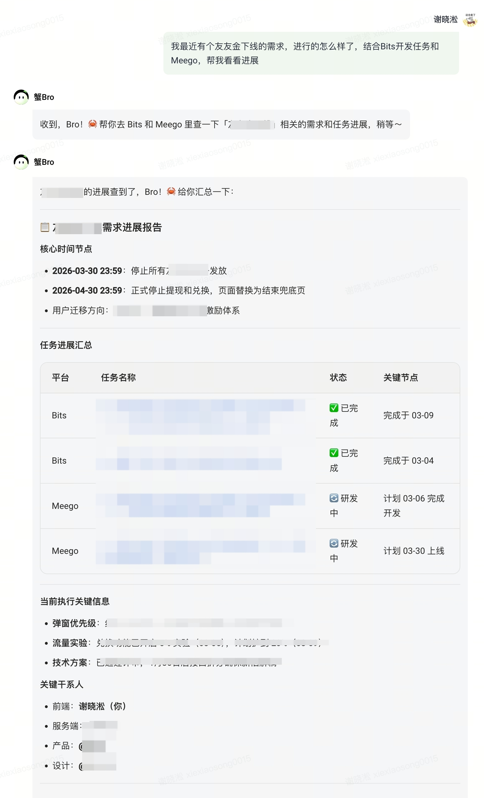
>   > 
>   > 
> </column>
> </grid>
<!-- END_BLOCK_75 -->

<!-- BLOCK_76 | BK2Ndu3zeoofyQxegt6cqHb1nHf -->
- **让&nbsp;Aime&nbsp;助理更聪明，和它直接对话就能安装&nbsp;skill**@(zengduju@bytedance.com)
<!-- END_BLOCK_76 -->

<!-- BLOCK_77 | APuPd9uKvoEnQ0xHBTecgvZdnYg -->
> 想给 Aime 助理**加一个资讯与社媒的搜索&nbsp;skill（**[SenSight Skill - 给 OpenClaw 连上全网资讯和社媒信息](https://bytedance.larkoffice.com/wiki/Qy87wY0eNiK8rcktZ2QcOOwenLc)**）**，我**直接发给&nbsp;Aime&nbsp;助理对应的&nbsp;skill&nbsp;文档**，它就能快速理解和完成安装，随后就能基于 skill 帮我完成相应的检索任务了，非常方便。
> 
> <grid cols="3">
> <column width="41">
>   > > 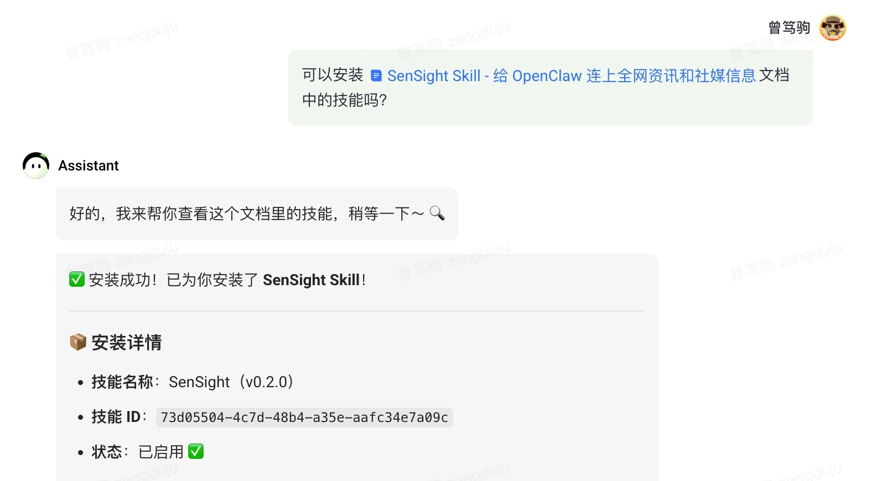
>   > 
>   > 
> </column>
> <column width="31">
>   > > 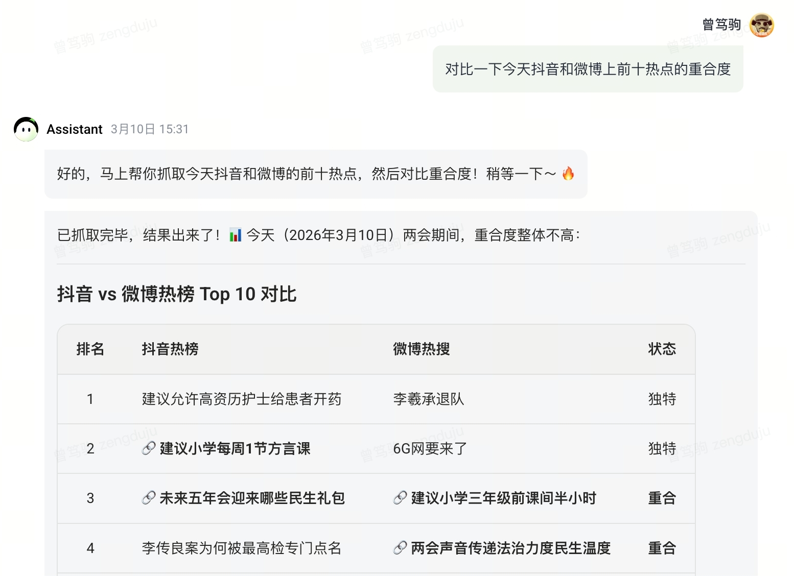
>   > 
>   > 
> </column>
> <column width="26">
>   > > 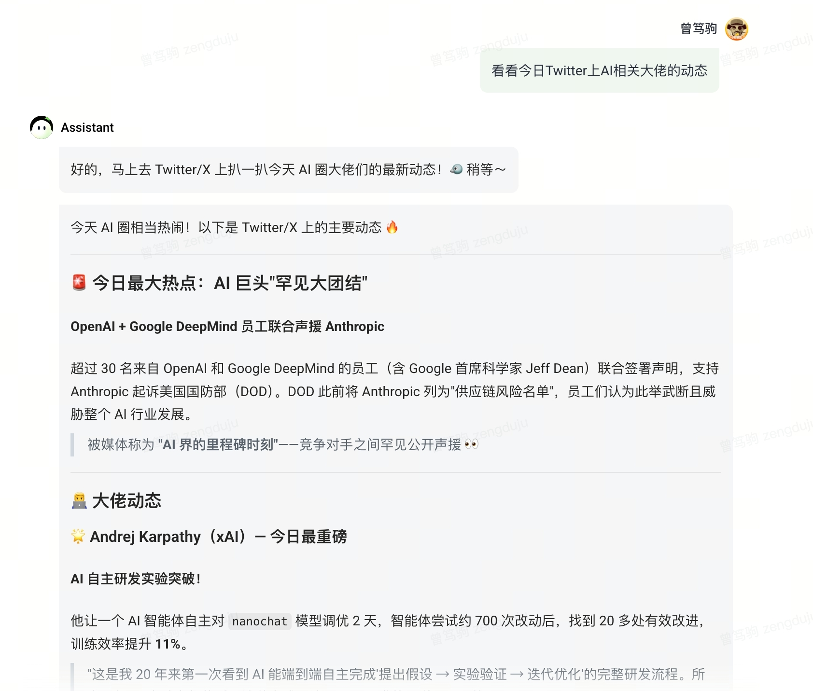
>   > 
>   > 
> </column>
> </grid>
> 💡 tips：官方 skill 精选集建设中，敬请期待
> 
<!-- END_BLOCK_77 -->

<!-- BLOCK_78 | AwiCdc65to8uLWxh3NGcBwwcnld -->
- **可以并发执行的Aime个人助理，效率真的太高了**@(tangying.0425@bytedance.com)
<!-- END_BLOCK_78 -->

<!-- BLOCK_79 | Merld5pXgoloV2xsT0DcEQzznbg -->
> Aime个人助理可以并发执行任务。任务执行过程中可以调整，可以随时查询任务中的状态，跟其他openclaw 差距很明显。我用来做报告，同一份报告可以随时起很多个任务修改不同章节，做不同事情，比如一个任务补充信息，另一个任务同时在 check 文档中的数字是否有具体的权威来源，特别好用。所以他出来之后我整理资料都用它了不用其他 agent，因为可以直接手机用，效率也高很多。还用它做技术架构调研，可以同一时间产出好几份～
> 
<!-- END_BLOCK_79 -->

<!-- BLOCK_80 | doxcnIlbJ7E9ZYKu7JTwfW9yXWg -->
## 六、FAQ<!-- 标题序号: 6 --><!-- comment for text `六、FAQ `：有架构设计方案可以分享么 --><!-- END_BLOCK_80 -->

<!-- BLOCK_81 | VBzmdYibYoyZA6xOGuZcsY3wnpb -->
### **Q：****和以前的 Aime 任务有什么区别？**<!-- 标题序号: 6.1 --><!-- comment for text `和以前的 Aime 任务有什么区别？`：能支持bot提交模板任务吗 如果是指用指定模板执行任务的话，可以通过对话要求查找指定模板，确认模板后提供相关参数即可执行任务 --><!-- END_BLOCK_81 -->

<!-- BLOCK_82 | XcKNdJiwmoiSPrxjFWNcwRwCnbh -->
**A：** 过去在 Aime 中，每个任务都是 **独立运行的**，需要依赖用户输入的 Prompt 和预置工具来完成，不同任务之间的上下文不会互通。
<!-- END_BLOCK_82 -->

<!-- BLOCK_83 | Us3zdPvwGo8ZO6xdWe8cfuMWncc -->
在 **个人助理模式** 下，助理会自动理解用户的问题，并将复杂任务拆分为多个子任务 **并行执行**。同时所有任务 **共享上下文与记忆**，能够更连贯地完成复杂工作。
<!-- comment for text `在 个人助理模式 下，助理会自动理解用户的问题，并将复杂任务拆分为多个子任务 并...连贯地完成复杂工作。`：个人助理是只支持一个吗 --><!-- END_BLOCK_83 -->

<!-- BLOCK_84 | doxcnxyjDNNjASMizwPjcDIggWg -->
### **Q：****和****&nbsp;****OpenClaw****&nbsp;****有什么区别？**<!-- 标题序号: 6.2 --><!-- comment for text `和 OpenClaw 有什么区别？`：有什么🦞能做，aime不能做的事吗 ？ --><!-- END_BLOCK_84 -->

<!-- BLOCK_85 | ONtEdxyO1om48exzEwEcjSYsnAg -->
**A：OpenClaw 更像是一个通用的 Agent 框架，而 Aime 个人助理是在企业环境中深度集成工具、可直接使用的 AI 工作助理产品。** 
<!-- END_BLOCK_85 -->

<!-- BLOCK_86 | U5bxdIyNHo2zu3xS46BcWWzonOh -->
- **产品形态不同**
	- **OpenClaw** 更偏向开源工具，需要用户自行部署和配置运行环境。
	- **Aime 个人助理** 是平台化产品，助理已预部署在 Aime 云端，用户 **无需安装或配置环境即可直接使用**。
<!-- END_BLOCK_86 -->

<!-- BLOCK_87 | JD0Kd5Rp8oKHkUx3ye7c54vLnBe -->
- **工具与平台集成不同**
	- **OpenClaw** 主要依赖用户自行配置工具与能力。
	- **Aime 个人助理** 已预置多种 **Skill 与 MCP 能力**，并打通字节内部多个平台工具，可直接用于实际工作场景。
<!-- END_BLOCK_87 -->

<!-- BLOCK_88 | CWCHdMjS5obaG7xcdaqcFhknnHf -->
- **用户记忆与使用体验不同**
	- **OpenClaw** 更多是任务级 Agent 运行模式。
	- **Aime 个人助理** 会继承用户在 Aime 中的 **历史任务记录、使用偏好与上下文记忆**，形成长期陪伴的个人工作助理。
<!-- END_BLOCK_88 -->

<!-- BLOCK_89 | Kc2wdOYrroj9btxnCTJcPuyunVc -->
- **合规与安全机制不同**
	- **Aime 个人助理** 运行在平台云端环境，与用户本地工作电脑隔离，权限与数据更加可控，也更符合企业使用场景。
<!-- END_BLOCK_89 -->

<!-- BLOCK_90 | YRJNd8UWcoDGh6xKMobcrVDInYe -->
### **Q：****如何让 Aime&nbsp;****个人助理****记住我的偏好？**<!-- 标题序号: 6.3 --><!-- END_BLOCK_90 -->

<!-- BLOCK_91 | MBDRdST5gowvHaxxW6Jcj1OKngf -->
A：在 Web 端-个人助理的设置里有「用户档案」文档，可以直接写入你的偏好（如常用格式、输出语言等），也可以通过对话告知助理，它会自动记录。
<!-- END_BLOCK_91 -->

<!-- BLOCK_92 | doxcn7AmqAywCWBwVXxvk7cmfHb -->
### **Q：如何给个人助理安装 / 扩展 Skill？**<!-- 标题序号: 6.4 --><!-- END_BLOCK_92 -->

<!-- BLOCK_93 | AwtidLIWroxEQSxhC8QcLxcUn7f -->
A：在与Aime助理直接对话即可让助理自行检索安装，也可以发送skill.zip 、文档或下载链接让Aime助理自行装配。如："帮我查看下是否有excel处理相关的skill可以用"，“帮我安装这个skill”（上传个附件）
<!-- END_BLOCK_93 -->

<!-- BLOCK_94 | GanWdoRACoTAsvxeM6Fc8R9pnDb -->
### **Q：个人助理卡住了/不回复怎么办？**<!-- 标题序号: 6.5 --><!-- END_BLOCK_94 -->

<!-- BLOCK_95 | EpIDdnOsHoX6Xsxj92ncvlWgn1L -->
A：可以先尝试发送`/clear`指令清除上下文。另外内测期间可能存在资源不足的情况，可关注内测群中的信息。
<!-- comment for text `清楚`：typo --><!-- END_BLOCK_95 -->

<!-- BLOCK_96 | Qplrdcl02ooXnixoDgkcjOv3nVb -->
`/clear`指令不会清除记忆，我们也会尽快修复这类问题。
<!-- END_BLOCK_96 -->

<!-- BLOCK_97 | TY4Id7M3toLRVmx6a4ZcKnTcnpb -->
### **Q：为什么有时候在飞书****&nbsp;****bot****&nbsp;****里提出的任务，后续没有在飞书里给我反馈？**<!-- 标题序号: 6.6 --><!-- END_BLOCK_97 -->

<!-- BLOCK_98 | FifVdlak1oeRlmxznumcHfbTncb -->
A：目前我们在 Web 端发的消息，只会回复到 Web 端。比如你在 bot 问完，马上去 Web 追问了别的消息，然后消息就会一直回复到 Web 里面，最终任务结束后，也只回复到了 Web 端。这个我们后续会上线一个策略：如果 5min 后没有读 Web 的消息，我们会在 bot 通知你的。
<!-- END_BLOCK_98 -->

<!-- BLOCK_99 | E7Z0dTdQtoBFTIxjzwvcv3vfn4g -->
当然，同学也可以在不方便用电脑的时候，随时在bot发送“同步下任务进展”，让助理把在web运行的任务和结果同步给你。
<!-- END_BLOCK_99 -->

<!-- BLOCK_100 | N4eLdBvF8oX3dtxHxBbc58prnuc -->
### **Q：不能自定义飞书****&nbsp;****bot****&nbsp;****机器人吗？**<!-- 标题序号: 6.7 --><!-- END_BLOCK_100 -->

<!-- BLOCK_101 | XNWbdMfPooHZ8MxnyxXcHXPgnEh -->
A：暂时不支持，Aime 现在是统一使用了一个官方预置 飞书bot 作为预置机器人，背后是通过工程进行路由，基于用户ID路由到每个人的专属 agent，配置、上下文、记忆等完全隔离。
<!-- comment for text `官方预置 飞书bot 作为预置机器人`：在群消息中如果多人都邀请了个人小助手，用户怎么识别是哪个同学的专属小助手呢 自动识别，在群里容器也是独立不互通的，谁@助理，助理就用谁的权限执行任务。@wangxin.5@bytedance.com  意思是别人不能@我的助理？@yinshiting@bytedance.com  不能哦@yinshiting@bytedance.com  个人与个人不互通的，但是我们后续也会支持自定义助理 --><!-- END_BLOCK_101 -->

<!-- BLOCK_102 | KAL9de8ZZoSExcxfDlncIgiKnqc -->
这样的好处是降低了用户初始化和后续权限申请等流程，既保证了解决针对个人助理做自定义调试的诉求，也降低了初始化成本。
<!-- END_BLOCK_102 -->

<!-- BLOCK_103 | XyNkdFjSGoVdUDx4kTJccgsLnEc -->
自定义机器人的场景我们也有考虑，后续会支持有自定义诉求的用户配置个人机器人，可配置多个飞书bot作为不同的消费渠道，且上下文打通。
<!-- END_BLOCK_103 -->

<!-- BLOCK_104 | UlaqdwjuOoGpbAxnFnVcJK6Vnnf -->
### **Q：可以用****&nbsp;****Aime****&nbsp;****助理发****飞书消息****和****飞书卡片****吗？**<!-- 标题序号: 6.8 --><!-- END_BLOCK_104 -->

<!-- BLOCK_105 | WLl2dgOBMoJ4zixALc2cWyjsnJc -->
A：为了避免过度打扰，目前是不允许用户让 Aime 助理私发消息给其他用户的，仅支持将消息发给自己。另外，飞书卡片能力正在迭代，后续会开放发送飞书卡片到指定群聊、发自己、或者调用用户自己的机器人等功能。
<!-- END_BLOCK_105 -->

<!-- BLOCK_106 | LPQ8dGrDzo5DGlxbOUPcJ0Q6nec -->
### **Q：****海外版 Aime 的个人助理功能什么时候上线？**<!-- 标题序号: 6.9 --><!-- comment for text `海外版 Aime 的个人助理功能什么时候上线？ A：海外资源有限，正在申请中。`：求问这个有预期时间嘛？ --><!-- END_BLOCK_106 -->

<!-- BLOCK_107 | I67NdcwX1o2b30x1pfIcXr5fnOe -->
A：海外资源有限，正在申请中。
<!-- END_BLOCK_107 -->

<!-- BLOCK_108 | MbwUdvgdLo9nuWxEmZlcseWAnOc -->
### **Q：怎么样确保自己的****&nbsp;****Aime****&nbsp;****助理****拥有最新的能力**<!-- 标题序号: 6.10 --><!-- comment for text `拥有最新的能力`：可以有每一次版本更新的changelog吗，好奇😄 --><!-- END_BLOCK_108 -->

<!-- BLOCK_109 | LW1gdhkJPomHe9xzLBicOSkXnvd -->
A：可关注个人助理 Web 端右上角的更新通知，及时点击按钮完成升级。
<!-- comment for text `更新通知，及时点击按钮完成升级。`：这个能做到，系统会找一个闲时自动帮我升级吗？还是说如果我不点它，它就永远不会升级了？ 会在用户没有正在处理任务的时候滚动更新 --><!-- END_BLOCK_109 -->

<!-- BLOCK_110 | N7SfdgzmOoUUYTxIXmHcgYkSnUh -->

<!-- comment for text `[图片]`：升级会丢失当前任务状态。。。 同学这个问题已经在高优解决了哈@wanruiling.wrl@bytedance.com  给个提示也可以，让用户选是不是马上更新 --><!-- END_BLOCK_110 -->

<!-- BLOCK_111 | HvTDdA4JYo15TYxjKr4crhWInGh -->
### **Q：如何获得个人助理生成的文档权限？**<!-- 标题序号: 6.11 --><!-- END_BLOCK_111 -->

<!-- BLOCK_112 | QhALdv2Lbow5dzxPlbNcqUpunkg -->
A：
<!-- END_BLOCK_112 -->

<!-- BLOCK_113 | Nkf2dtmDHoubksxIjtCcO2bwngg -->
方法一（推荐）：让助手把文档链接通过附件形式发给你，然后在 Web 界面上点击获取链接。
<!-- comment for text `件形式发给你，然后在 Web 界面上点击获取链接。`：我设置了每日推送，这些文档都保存在什么目录啊 有什么办法能把以往他批量生成的每日推送的文档 统一归档到某个地方吗 Aime任务都在这个文件夹，同学可以批量处理，优化文档权限处理的工作已经在做了@wangxin.5@bytedance.com  没发现这个文件夹在哪呢....@lixiaoyang.1@bytedance.com  私聊我共享下屏幕？ --><!-- comment for text `方法一（推荐）：让助手把文档链接通过附件形式发给你，然后在 Web 界面上点击获取链接。`：生成的文档别人可见吗，没找到可以设置等级的地方 同学按这个操作转移的飞书文档权限后，就跟正常的飞书文档密级和分享范围管理一样了，跟自己写的一样管理就行 我通过链接在浏览器打开后文档所有者还是Aime个人助理，虽然我可以编辑，但没有把文档的所有权转移给我让我可以设置保密等级。@chenpengyu.adrian@bytedance.com  是的，你通过这个方式获取下所有权权限吧 我们后续会优化这个授权模式，让体验更丝滑 --><!-- END_BLOCK_113 -->

<!-- BLOCK_114 | LJLzdBn65o0n6Lx1JfuclTU0n74 -->
<grid cols="2">
<column width="28">
  
</column>
<column width="71">
  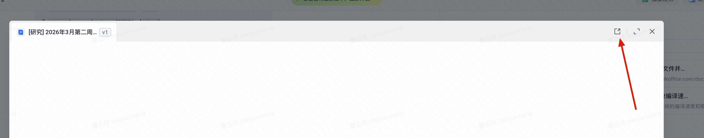
</column>
</grid>
<!-- END_BLOCK_114 -->

<!-- BLOCK_115 | U55NdLE5tot0WaxQoxXcwJwWnzg -->
方法二：点击 Web 端的独立任务，找到相应的任务链接，点击进入任务详情页，然后点击获取飞书文档链接。
<!-- END_BLOCK_115 -->

<!-- BLOCK_116 | A21Ndv6ylo9hjCxsjF6c0aMynBd -->
<grid cols="2">
<column width="44">
  
</column>
<column width="55">
  
</column>
</grid>
<!-- END_BLOCK_116 -->

<!-- BLOCK_117 | O6FVdCNrZo8lJUx9bsucAqMon3b -->
### **Q：可以实现在一个团队能够共用一个助理，共同维护助理的记忆吗？**<!-- 标题序号: 6.12 --><!-- END_BLOCK_117 -->

<!-- BLOCK_118 | HJJOdOZQIoTXKuxQN4FcVGbYnye -->
A：团队助理后续会上线~
<!-- comment for text `团队助理后续会上线~`：这个有预期时间吗？@bianyikai@bytedance.com  目前还在方案阶段哈 --><!-- END_BLOCK_118 -->

<!-- BLOCK_119 | doxcnOaX8LUvpFzyXOgZ2u7SUdd -->
### **Q****：****遇到 Bug 去哪里反馈？**<!-- 标题序号: 6.13 --><!-- END_BLOCK_119 -->

<!-- BLOCK_120 | Vwsgd0CueoO56Qx21zNczgrFncc -->
A：[点击加入内测群](https://applink.larkoffice.com/client/chat/chatter/add_by_link?link_token=a12g4f96-f843-4ae1-abd5-9e7febd0c3cc) 反馈
<!-- END_BLOCK_120 -->

<!-- BLOCK_121 | doxcnSmFdPkyQYCdIRfuNVyeeEe -->
### **Q：有好的使用案例想分享？**<!-- 标题序号: 6.14 --><!-- END_BLOCK_121 -->

<!-- BLOCK_122 | JuQTdi04NodQzcxasOTcy3vdnCb -->
A：欢迎联系@(wangxin.5@bytedance.com)@(wangwei.aaron@bytedance.com)@(wanruiling.wrl@bytedance.com)，也欢迎在内测群中分享你的使用心得～
<!-- END_BLOCK_122 -->

