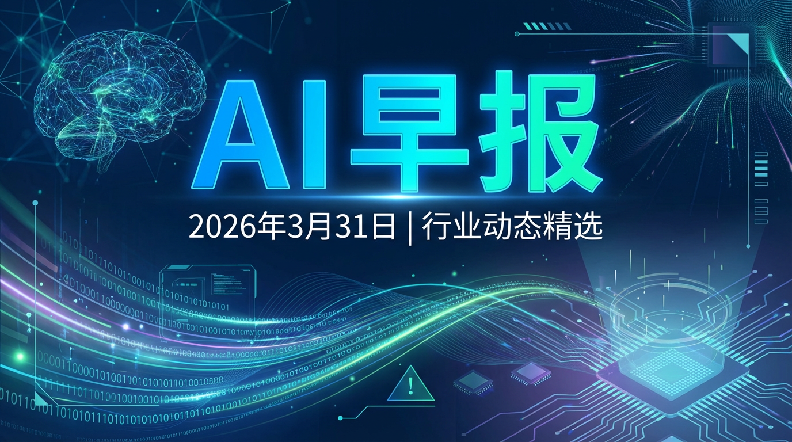

<callout icon="bulb" bgc="5">  
**📅 今日日期：2026年3月31日 | 星期二**  
欢迎收看今日的“AI 早报”！在这里，我们为您搜罗了全球 AI 行业的最新热点，助您快速掌握智能时代的脉搏。  
</callout>

---

## 🚀 巨头风向标：OpenAI 与 Anthropic 的巅峰对决

### 🧠 Anthropic：Claude 4 震撼发布，开启“混合推理”时代
Anthropic 今日正式发布了全新一代模型 **Claude 4 系列**（包含 Opus 4 和 Sonnet 4），这标志着 AI 推理能力的又一次质变。
- **混合推理模式 (Hybrid Reasoning)**：引入了“扩展思考模式”（Extended Thinking Mode），模型可以像人类一样在回答前进行深度“思考”。Claude 4 默认会展示简化的思维链，开发者也可以选择查看完整路径。
- **自主“电脑操作”**：Claude 4 不再只是对话框里的字符，它已经具备了真实操作电脑的能力（点击、打字、移动光标），能够自主完成长时程、复杂的编码与办公任务。
- **安全等级**：Opus 4 被评定为 AI 安全等级 3（ASL-3），展现了 Anthropic 在高性能与安全性之间的极致平衡。

### 🤖 OpenAI：GPT-5.4 家族壮大，ChatGPT 变身“导购专家”
OpenAI 近期动态频频，不断巩固其生态领先地位。
- **多尺寸模型**：继 GPT-5 发布后，**GPT-5.4 mini 与 nano** 于 3 月 17 日正式上线，为移动端和边缘计算提供了更轻量、高效的选择。
- **产品探索功能**：ChatGPT 现在可以直接在对话中帮用户“逛街”了。通过新功能，用户可以更直观地在聊天界面发现和探索商品。
- **安全保障**：上线了“安全性风险赏金计划”，并发布了针对青少年的 AI 使用政策及 GPT-OSS 安全防护措施，强调其社会责任感。

---

## 🛠️ 智能体（AI Agent）：从“对话”迈向“协作”

### 📋 Cline Kanban：像管理团队一样管理 AI 代理
开源编程神器 Cline 发布了 **Cline Kanban**，彻底改变了开发者与 AI 协作的方式。
- **可视化看板**：不再需要切换 20 个终端窗口，现在所有的 AI 代理任务都像 Trello 卡片一样排列在看板上。
- **依赖关联**：支持任务间的依赖设置，前置任务（如 API 设计）完成后，后续任务（如代码实现）可自动触发。
- **模型中立**：不仅支持 Cline 自己的代理，还兼容 Claude Code 和 Codex，让你成为真正的“代理调度官”。

### 💻 Microsoft Copilot Cowork：你的 AI “工位搭子”
微软发布了 **Copilot Cowork**，这是一款内置于 Microsoft 365 平台的自主代理。
- **长时程任务**：它能自主处理跨越 Excel、Teams、SharePoint 的复杂工作流（如月度财务报表汇总），无需人类时刻“监工”。
- **多模型协作**：Copilot 内部引入了“批判层”（Critique Layer），GPT 负责起草，Claude 负责审计，这种“双保险”机制让 AI 的幻觉率大幅降低。

---

## 📉 行业趋势与洞察

<grid cols="2">  
<column width="50">  
**📈 市场爆发**  
据 3 月份最新数据显示，全球智能体 (Agentic AI) 市场规模预计将从 2026 年初的 91.4 亿美元飙升至 2034 年的 1390 亿美元。  
</column>  
<column width="50">  
**🏢 企业应用**  
约 79% 的 Global 2000 企业已开始在核心业务中部署 AI Agent，AI 正在从“实验性工具”转变为“企业基础设施”。  
</column>  
</grid>

<callout icon="star" bgc="3">  
**💡 专家观点：** 2026 年被业内公认为“智能体元年”。现在的重点不再是“哪个模型更强”，而是“如何更好地编排和治理这些代理”。  
</callout>

---

以上内容由 Aime 为您整理。AI 浪潮滚滚向前，愿您始终立于潮头！🌊
