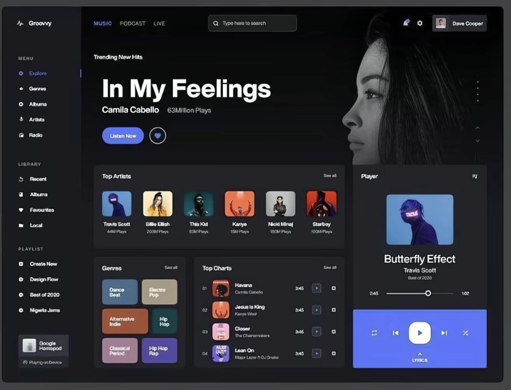
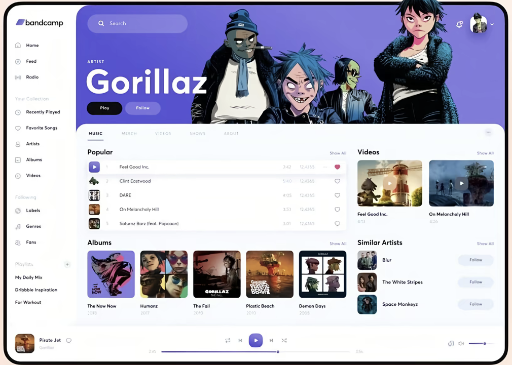
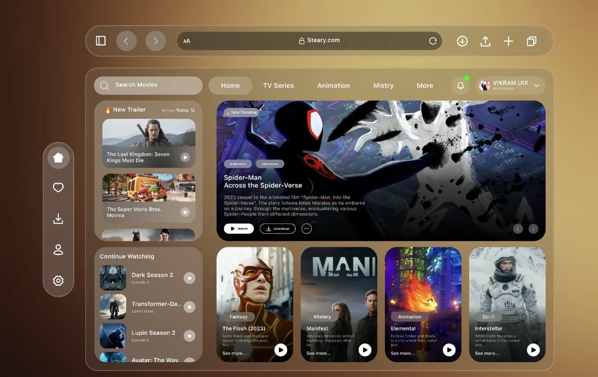

# Cool Redesign: UI 设计趋势与视觉风格分析报告

<callout icon="bulb" bgc="5">  
本报告旨在分析用户提供的设计偏好，并结合 Awwwards 2025-2026 全球设计趋势，为 **Cool Redesign** 项目提供具体的视觉与交互设计参考方向。  
</callout>

---

## 一、 用户设计偏好分析

基于用户提供的三套设计参考（Groovy 音乐播放器、Bandcamp 概念版、Steary 视频流媒体），我们识别出以下核心偏好：

<grid cols="3">  
<column width="33">  
  **1. 沉浸式深色模式 (Groovy)**  
    
  *   **特点**：极简高对比度、强调封面艺术、功能区块化。  
  *   **视觉**：深色背景搭配鲜艳的强调色（Periwinkle Blue）。  
</column>  
<column width="33">  
  **2. 层次化轻量布局 (Bandcamp)**  
    
  *   **特点**：大面积留白、容器重叠布局、大圆角设计（20px+）。  
  *   **视觉**：柔和阴影创造物理层级感，图文混排极具杂志感。  
</column>  
<column width="33">  
  **3. 玻璃拟态与悬浮感 (Steary)**  
    
  *   **特点**：半透明毛玻璃、背景模糊、悬浮式 Dock 栏。  
  *   **视觉**：高科技感、空间纵深感，强调内容与背景的互动。  
</column>  
</grid>

**核心偏好总结：**
*   **大圆角与软 UI**：所有参考均倾向于圆润、易亲近的边缘设计。
*   **卡片式架构**：采用 Bento-box 式布局，信息模块化程度高。
*   **视觉深度**：偏好通过透明度、阴影、层叠关系构建 Z 轴深度，而非纯扁平化。

---

## 二、 Awwwards 2025-2026 全球设计趋势

结合最新趋势研究（Wannathis, Awwwards），2026 年的 UI 设计将重点关注以下领域：

1.  **AI 作为设计伙伴**：界面将更加响应式，AI 处理基础布局，设计师聚焦于创意细节。
2.  **滚动式叙事 (Storytelling through scrolling)**：滚动不再是功能，而是引导用户体验故事的节奏。
3.  **重新定义的数字怀旧 (Digital Nostalgia)**：2000 年代的元素（像素图标、渐变）以现代、高保真的形式回归。
4.  **电影级 UI 预览 (Cinematic UI Previews)**：动效成为设计的中心，全屏视频与平滑过渡定义体验。
5.  **抽象 3D 背景与动效形状**：界面背景引入流体 3D 形态，增加质感而不干扰功能。

---

## 三、 Cool Redesign 建议参考方向

针对 Cool Redesign 的笔记应用背景，建议融合以下方向：

<table header-row="true">  
    <tr>  
        <td>维度</td>  
        <td>建议策略</td>  
        <td>具体参考</td>  
    </tr>  
    <tr>  
        <td>**视觉风格 (Style)**</td>  
        <td>**混合玻璃拟态 (Mixed Glassmorphism)**</td>  
        <td>采用类似 Steary 的半透明边栏，但在主内容区使用 Bandcamp 式的实体白/深色卡片，平衡美观与长期阅读的舒适度。</td>  
    </tr>  
    <tr>  
        <td>**布局架构 (Layout)**</td>  
        <td>**动态 Bento Grid**</td>  
        <td>将笔记、任务、最近文件以不同尺寸的卡片排列。建议在侧边栏使用 Groovy 式的固定导航与 Steary 式的悬浮 Dock 组合。</td>  
    </tr>  
    <tr>  
        <td>**交互体验 (UX)**</td>  
        <td>**电影级微动效**</td>  
        <td>利用“滚动式叙事”趋势，在切换笔记分类或打开详情页时，使用平滑的缩放与淡入淡出（Cinema Transitions），增强仪式感。</td>  
    </tr>  
    <tr>  
        <td>**AI 集成 (AI)**</td>  
        <td>**响应式辅助 UI**</td>  
        <td>在笔记页面设计一个常驻但低干扰的 AI 助手入口，视觉上采用“Digital Nostalgia”风格的小图标或抽象 3D 球体，体现未来感。</td>  
    </tr>  
</table>

---

## 四、 结论

**Cool Redesign** 的核心方向应定位在 **“具有未来纵深感的笔记助手”**：
*   **色调**：建议采用“深空灰”基础搭配“磨砂玻璃”元素。
*   **重点**：通过 **3D 深度** 和 **大圆角卡片** 构建层次，摒弃传统列表的沉闷。
*   **亮点**：引入 **微动效反馈**，让笔记的记录过程更具互动节奏。

---
**数据来源与参考：**
- 用户提供的 IM 消息图片（Groovy, Bandcamp, Steary）
- [Top UI Design Trends 2026 | Wannathis](https://wannathis.one/blog/top-ui-design-trends-for-2026-you-cant-ignore)
- Awwwards Current Showcase Trends 2025
